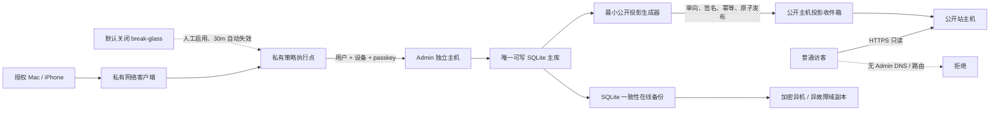

# M5 Admin 双主机安全与四小时恢复基线审核报告

## 1. 唯一结论

**PASS，仅针对双主机安全与恢复合同候选。P0=0，P1=0，P2=3。**

用户已确认唯一拓扑：

- **Admin 独立小型服务器**承载 Admin 应用、处理链和唯一可写 SQLite 主库。
- **公开站主机**只接收并持有最小公开只读投影；没有主库凭据、Admin mutation 权限或共享文件挂载。
- 跨主机投影保持单向、幂等、可校验、可重建，不形成第二业务真值；具体传输机制留给后继产品合同。
- 日常 Admin 只经 Mac/iPhone 上的私有网络客户端访问；两端均具备完整 Admin 能力。
- 恢复目标固定为 `RTO ≤4 小时`、`RPO ≤15 分钟`。

本报告不批准或实施主机、供应商、DNS、TLS、账号、端口、私有通道、备份介质、密钥、数据库、监控或生产能力。PASS 表示静态合同没有遗留 P0/P1；所有运行属性仍需部署收据证明。

## 2. 证据等级与审查范围

| 等级 | 事实 |
|---|---|
| 已确认 | 用户选择独立小型 Admin 服务器；确认唯一写 SQLite 主库位于 Admin 主机；公开主机仅有可重建公开投影；C 方案、Mac+iPhone 全功能、`RTO ≤4h`、`RPO ≤15m` 均已确认。 |
| 已验证（本地） | 上游 `TASK-20260809-19F245` 为 acknowledged；C 方案报告及 RPO 后继记录存在；当前项目合同仍把生产 Admin/跨网络访问视为未实现边界。 |
| 官方依据 | SQLite Online Backup API 可在在线数据库上生成一致快照；NIST 零信任要求不能仅凭网络位置或设备归属授予信任。 |
| 推断 | 物理双主机、凭据域分离、单向签名投影和独立备份故障域能限制公开站失陷向 Admin 横移，并使公开站可从唯一真值重建。 |
| 待部署验证 | 主机/系统、网络、客户端、TLS、应用认证、SQLite 运行参数、投影通道、备份介质、恢复时间、告警、补丁、Mac/iPhone 和中国大陆网络表现。 |

## 3. 双主机信任边界

### 3.1 必须同时成立的不变量

1. 两台主机使用不同操作系统账户、服务身份、密钥域、会话 Cookie、部署凭据、网络策略和文件系统；无共享主目录、共享挂载或共享数据库路径。
2. 公开站没有 Admin 主库文件、主库访问凭据、私有通道控制凭据、备份解密密钥或 Admin mutation 服务身份。
3. Admin 主机没有公网 Admin listener；Admin 应用只绑定 loopback 或专用私有接口，由私有策略执行点转发。公共 DNS 无 Admin `A/AAAA/CNAME`，公开反向代理无 `/admin` upstream/rewrite/fallback。
4. 私有网络位置只提供可达性；应用仍执行用户身份、设备身份、passkey、角色、服务端会话、精确 Origin、一次性 CSRF、限流与审计。
5. SQLite 主库在任意时刻只有一个写者主机。恢复、测试、公开站或备用主机均不能并发写同一业务真值。
6. 公开投影是可丢弃缓存/发布物；其内容能由 Admin 唯一写主及冻结规则重建。公开投影不能反向同步成 Admin 事实。
7. Admin 主机、公开主机和唯一备份副本不能全部落在同一故障域。公开主机不能兼任唯一备份目标。

## 4. 主机级最小安全基线

| 控制 | Admin 独立主机 | 公开站主机 |
|---|---|---|
| 网络入口 | 无公网 Admin 入口；仅私有通道策略点和受控本地控制台 | 公网只开放公开站所需 HTTPS；管理入口与应用入口分离 |
| 网络出口 | 默认拒绝；只允许经确认的时间同步、补丁、投影、加密备份、审计/告警和私有控制面目的地 | 默认拒绝；只允许公开站必需出口；不能主动连接 Admin 主库或私有管理面 |
| 服务身份 | Admin 应用、投影生成、备份、审计分别最小授权；不能共用 root | 公开应用只读本地投影；投影接收器仅能写 staging/inbox，不能执行任意命令 |
| 文件系统 | 主库、WAL、密钥、备份 staging 目录彼此最小权限；禁止共享挂载 | 只含公开 DTO/媒体引用和投影 manifest；无内部字段、凭据或私密日志 |
| 系统管理 | 管理动作只经独立受控通道；高风险变更重新认证 | 管理动作不复用公开 Web 会话；公开 Web 进程无系统管理权限 |
| 补丁 | 支持期内系统；高危修复有明确窗口和回退；补丁前先生成已验证恢复点 | 同等补丁门；公开站可重建，故障时优先隔离和重装 |
| 密钥 | 主身份、设备、投影签名、备份加密分域；定期轮换与撤销 | 只持有验证投影所需公钥/最小接收凭据；无签名私钥或备份解密密钥 |
| 日志 | Admin mutation、登录、设备、备份、恢复、break-glass 追加式脱敏审计 | 请求、投影接收/拒绝、完整性和异常脱敏日志；禁止泄露 Admin 地址/凭据 |

系统防护合同还应包含：关闭无用服务、最小软件集合、可信启动/磁盘加密能力待平台验证、时间同步与 `clock_status`、配置 hash、资源上限、进程退出自动 fail closed、秘密扫描、日志轮换和磁盘余量告警。具体工具和供应商不在本任务选择。

## 5. 单向公开投影合同

### 5.1 数据面

每个投影批次至少携带：`projection_id`、单调 `generation`、源数据/批准 bundle hash、schema/version、生成时间、记录数、文件 hash、签名 key ID、幂等 key 和签名。公开主机必须执行 allowlist schema、签名、hash、generation、大小、数量和公开字段检查。

投影中只允许公开 DTO 所需字段；禁止主库路径、内部 ID、session、设备、账号、审核备注、私有来源信息、凭据、stack、环境变量和未批准内容。投影失败不能回退到 fixture/demo/旧内部数据源。

### 5.2 传输不变量

- 数据方向只能是 Admin 发布面 → 公开投影收件箱；公开主机不能经同一通道请求 Admin mutation、数据库查询或任意文件。
- 传输凭据只允许创建新的投影 staging 对象或读取指定不可变对象；不能覆盖已激活投影、登录 Admin 或访问备份。
- 接收流程为 `staging → 完整校验 → 原子激活`。任何中断、重复、乱序、回滚 generation、签名/hash 不符或字段越界均保持 last-known-good。
- 相同幂等键和内容 hash 的重复投递返回同一结果；相同幂等键配不同内容必须拒绝并告警。
- 激活收据可以单向返回最小状态，但不能携带可用于 Admin mutation 的能力。具体 push、pull 或中立对象传递机制由产品合同选择。
- 删除公开主机或全部投影后，必须能从 Admin 唯一真值确定性重建；重建测试是“没有第二业务真值”的机械出口。

## 6. 应用身份与双端完整能力

Mac 与 iPhone 分别安装私有网络客户端、分别登记、分别撤销；两端对同一角色暴露相同 Admin 操作集合。移动端可以为高风险动作增加新鲜 passkey、前台显式确认、短授权窗口和更严格限流，不能删除功能入口或永久降为只读。

Admin mutation 的共同硬门：有效用户与设备决策、WebAuthn/passkey、服务端 opaque 会话、`__Host-` Secure/HttpOnly/SameSite Cookie、精确 HTTPS Origin、一次性 CSRF（绑定 session/method/path/body hash/时间）、资源级授权、幂等/CAS、防重放、脱敏审计。私有通道中继或冷备用 WireGuard 不能绕过这些应用门。

## 7. RPO ≤15 分钟备份基线

1. 使用 SQLite Online Backup API、`VACUUM INTO` 的受控等价路径，或经独立验证具有相同一致性保证的单写快照。SQLite 官方说明 Online Backup API 完成后生成源数据库开始复制时点的一致快照；活动数据库文件的普通复制存在并发和故障风险。[SQLite Backup API](https://www.sqlite.org/backup.html)
2. 备份尝试基准间隔设为 **≤5 分钟**，为失败重试和异故障域持久化预留余量；最近一个**完成一致性验证并成功异域持久化**的恢复点年龄必须始终 `≤15 分钟`。
3. 备份完成的判据必须同时包含：SQLite API 成功、目标关闭/落盘成功、SQLite 完整性检查、schema/ledger/application 版本匹配、allowlist manifest、内容 hash、加密完成、异故障域持久化回读成功。
4. WAL 模式下，备份 API/快照负责形成单一一致性视图；禁止分别复制活动 `db`、`-wal`、`-shm`。WAL、checkpoint 和 `synchronous` 的具体运行值需后继性能/耐久性测试冻结，不能以性能优化削弱已确认 RPO。
5. 备份在传输和静态保存时加密；解密材料与密文分离，公开站不持有解密材料。至少一个已验证恢复点位于与 Admin/公开主机不同的故障域。
6. 失败备份不能更新成功时间。成功恢复点年龄达到 10 分钟预警；达到 15 分钟记为 RPO breach，立即告警并关闭新的高风险 mutation。读操作及公开 last-known-good 可继续，直到恢复能力重新验证。
7. manifest 至少记录 backup ID、开始/完成时间、源 schema/application/SQLite 版本、journal mode、源逻辑标识、内容 hash、文件大小、加密/密钥版本引用、目标故障域类别、验证结果、前一恢复点引用和脱敏 reason code；禁止 secret、主机绝对路径和私密正文。
8. 具体保留周期仍需产品/合规确认；删除策略必须保留至少一个已演练 last-known-good，并覆盖密钥轮换、损坏隔离和不可恢复删除。

## 8. RTO ≤4 小时恢复步骤

| 累计时限 | 动作 | 硬出口 |
|---:|---|---|
| 0–15 分钟 | 宣告事故；停止 Admin 新连接/mutation；隔离受影响主机；保存脱敏证据；公开站维持 last-known-good 只读 | 无第二写主、无自动公网降级；事故 ID 与起始时间落账 |
| 15–45 分钟 | 判定公开站、Admin、通道或备份故障域；撤销受影响 session/设备/服务凭据；选择年龄 `≤15m` 的候选恢复点 | manifest/hash/密钥可用性通过；受污染恢复点隔离 |
| 45–120 分钟 | 重装/启用冷备用 Admin 主机；恢复最小系统、私有通道与应用配置；保持应用只读/关闭 mutation | 配置 hash、补丁、主机身份和无公网监听通过 |
| 120–180 分钟 | 解密并恢复唯一写 SQLite；检查 SQLite 完整性、WAL/journal、schema、ledger、hash、业务不变量 | 只有一个候选写主；任何检查失败继续 fail closed |
| 180–210 分钟 | 私有通道下启动 Admin 只读；验证 Mac+iPhone、passkey、会话、Origin、CSRF、审计、no-egress | 双端认证与失败路径通过；公网仍不可达 |
| 210–225 分钟 | 明确提升唯一写主；执行最小 synthetic mutation 和回滚/幂等检查 | 写入、审计、备份触发正常；无第二写者 |
| 225–240 分钟 | 从唯一真值重建并签名公开投影；原子激活；验证公开站只读；关闭临时恢复能力 | `RTO ≤4h`、`RPO ≤15m` 收据齐全；无临时端口/密钥/会话残留 |

任一步骤超时或失败：Admin mutation 保持关闭，公开站只继续 last-known-good 只读；禁止临时共享主库、把公开主机提升为写主、开启长期公网入口或跳过完整性检查追赶 RTO。

## 9. Break-glass 与冷备用通道

- 日常 client-based 私有主路径采用受认证直连或加密中继；冷备用为独立 WireGuard 或安全属性等价通道。
- 冷备用通道和 break-glass 是两种状态：冷备用通道恢复私有可达性，不能自动授予 Admin 权限；break-glass 临时改变应急访问策略，仍需应用鉴权。
- 两者默认关闭或无活动会话；只能由受控本地/带外控制台、明确人工动作和离线恢复认证器启用。
- break-glass 每次具名、单会话、最小角色、默认最长 30 分钟、不续期；服务端自动拒绝新连接、撤销会话/临时设备许可、删除临时策略并回读验证。
- 启用、首次使用、权限使用、临近到期、关闭和关闭失败全部写追加式脱敏审计并告警。自动失效失败即隔离 Admin 主机；不得转为常开公网登录页。

## 10. 故障与攻击面审查

| 场景 | 隔离/恢复链 | 验收出口 |
|---|---|---|
| 公开站主机失陷 | 切断公开主机；撤销投影接收凭据；Admin 与主库保持不可路由；重装公开主机；从签名投影重建 | 攻击者无法获得主库/Admin/备份密钥；重建后 generation/hash 连续 |
| Admin 主机失陷 | 停止写入和私有入口；撤销 session、设备/服务凭据；公开站保留 last-known-good；从干净镜像和异域恢复点恢复；全量轮换 | 单写者、RPO/RTO、无公网监听、双端鉴权和投影重建全部通过 |
| 投影通道被篡改/重放 | 签名、hash、schema、generation、幂等键、字段 allowlist 拒绝；保持 last-known-good | 零部分激活、零内部字段、明确脱敏告警 |
| 私有通道控制面/中继故障 | 新登录/提权/高风险 mutation fail closed；人工启用冷备用独立通道；应用鉴权不变 | 未自动开放公网；恢复后撤销临时通道和会话 |
| 唯一写主故障 | fencing 后确认旧主不可写；恢复候选保持只读直到完整性检查结束；明确提升一个新主 | 任意时点写主数量 ≤1；旧主不得自动回归 |
| 备份超龄/损坏 | 10m 预警、15m breach；高风险 mutation 关闭；损坏点隔离；继续尝试新一致快照 | 失败不推进成功时间；恢复演练证明可用后才解除 |
| 备份故障域或密钥失效 | 使用独立故障域/离线恢复凭据；密钥与密文分开；回读和解密演练 | 不依赖公开主机作为唯一副本；无长期公网备份入口 |
| 时间异常 | `clock_status` 告警；不能证明恢复点年龄时按超龄处理 | RPO 不能由不可信本机时钟伪造 |

## 11. 监控、审计与演练

最低告警：公网出现 Admin DNS/路由、Admin 主机公网 listener、公开站尝试连接主库、投影签名/hash/schema/generation 拒绝、异常登录/设备登记、会话或 CSRF 拒绝、backup age 10m/15m、备份失败/损坏/密钥不可用、磁盘余量、时间异常、补丁过期、唯一写主冲突、break-glass/冷备用通道启闭、审计接收失败。

审计事件至少记录：event ID、可信时间与 `clock_status`、actor/device/session hash、主机/服务身份引用、动作/资源、policy/config/schema/hash 版本、结果、reason code、trace/operation、backup/projection generation、恢复阶段和自动失效收据。禁止 token、Cookie、CSRF、passkey、恢复材料、完整路径、stack 和私密正文。

演练基线：

- 每季度：Mac/iPhone 分别访问、设备撤销、私有主路径故障、冷备用通道启闭、break-glass 自动到期、投影重放/篡改、公开站从零重建。
- 每半年：在隔离环境从异故障域备份完整恢复 Admin 主机和唯一写主，计时验证 `RPO ≤15m`、`RTO ≤4h`。
- 重大 schema、SQLite、密钥、网络、备份或部署变更后：追加一次聚焦恢复演练。

## 12. 公开/管理面回退

安全回退目标固定为：**公开站 last-known-good 只读继续，Admin 全关闭**。顺序为：拒绝 Admin 新连接与 mutation → fencing 唯一写主 → 撤销会话和临时设备/服务凭据 → 关闭 break-glass/冷备用通道 → 隔离受影响主机 → 恢复上一份已验证配置/数据库 → 私有只读验收 → 明确提升唯一写主 → 重建公开投影。

禁止把两台主机重新合并、挂载共享主库、把公开站临时提升为 Admin、使用公开站凭据恢复主库或长期开放公网入口。

## 13. P0/P1/P2 与尚待选择项

- **P0：0。** 双主机、唯一写主、公开不可路由、单向投影、RPO/RTO 和应急边界均有明确 fail-closed 合同。
- **P1：0。** 当前没有会导致产品/开发无法冻结该安全路线的重大静态缺口。
- **P2-1：备份保留期未选。** 需要产品/合规确认日/周/月保留及删除策略；不阻断拓扑冻结，阻断正式备份配置。
- **P2-2：投影传输机制未选。** push、pull 或中立对象传递均可，必须满足第 5 节全部不变量；阻断投影实现，不阻断路线。
- **P2-3：具体平台能力与大陆可用性 Unknown。** 主机、私有通道、证书、Mac/iPhone、三网、带外控制台、加密异域介质均需部署实测。

尚待用户选择仅保留两类产品参数：备份保留周期、投影传输机制。供应商、具体主机和工具选择不属于本任务。

## 14. 权威依据、已验证/未验证与错题自检

权威依据：

- [NIST SP 800-207 Zero Trust Architecture](https://csrc.nist.gov/pubs/sp/800/207/final)：网络位置或资产归属不能产生隐式信任，主体和设备需在会话前鉴别授权。
- [NIST SP 800-207A](https://csrc.nist.gov/pubs/sp/800/207/a/final)：网络参数之外还需应用和服务身份策略。
- [SQLite Online Backup API](https://www.sqlite.org/backup.html) 与 [SQLite Backup API reference](https://www.sqlite.org/c3ref/backup_finish.html)：在线一致快照、锁与并发行为、完成/失败判据。

已验证：任务 JSON 与上游两份安全记录；用户确认的独立主机/唯一写主/只读投影边界；C 方案、双端完整能力、`RTO ≤4h`、`RPO ≤15m`；本报告逐项覆盖双主机故障域、公开站不可路由 Admin、Admin 无公网监听、应用强认证、单向投影、单写与一致性备份、异域加密副本、恢复步骤、break-glass 自动失效和审计回退。

未验证：任何真实主机、监听、DNS、TLS、网络 ACL、私有客户端、WebAuthn、SQLite 参数、备份、投影、告警、恢复演练、供应商、证书、Mac/iPhone 和中国大陆网络/平台能力。本报告不得用作运行收据。

错题自检：未把物理分机当充分隔离；未把私网当身份；未让公开主机持有主库凭据或共享挂载；未形成第二真值或双向同步；未复制活动 SQLite 文件冒充备份；未用数据库双活、跨地域双活或长期公网入口追赶 RTO；未把命令成功、上传完成或文件存在冒充 RPO；未选择供应商、部署、开通或写入任何外部资源；未修改 app、Spec、ADR、data、design 或上游已 ACK 历史。

TASK_STATE_OK
