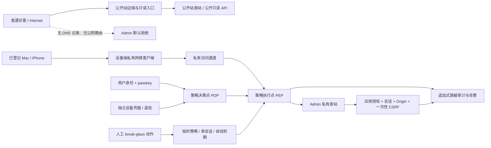

# M5 Admin 私有访问与 Break-glass 安全架构候选

## 1. 结论与边界

**唯一结论：PASS，冻结 C 方案的标准级候选（RTO ≤ 4 小时）作为产品/开发安全合同输入。** 日常 Admin 主路径固定为 Mac/iPhone 安装客户端后建立私有访问通道，并同时通过已登记设备、个人身份与抗钓鱼认证；正常路径优先使用直连，无法直连时使用受认证加密中继，另保留默认关闭的冷备用独立 WireGuard 或安全属性等价通道。break-glass 默认关闭，只能由明确人工动作临时启用并自动失效。Mac 与 iPhone 都必须提供完整 Admin 功能，不允许把移动端降为只读或删减操作入口。A、B 保留为被否决或受限降级方案，均不得成为日常入口。

本结论只批准安全架构候选的完整性，不批准部署、开通域名、账号、端口、外部网络、真实数据写入或生产能力。当前仓库仍是 loopback `local_dev_only` 候选；生产 Admin 身份、跨网络入口和运行收据尚不存在。

普通访客即使获知后台地址，C 方案的实际阻断链为：公开 DNS 无 Admin 可用记录 → 公网无 Admin 路由 → 私有访问策略执行点要求已登记设备与有效用户身份 → Admin 源站只接受策略执行点的受认证流量 → 应用层再要求 passkey、会话、精确 Origin、一次性 CSRF 与授权。隐藏路径、`robots.txt`、前端路由和“地址难猜”均不计入控制。

## 2. 证据等级

| 等级 | 本轮事实 |
|---|---|
| 已验证（仓库静态） | 公开路由候选是 `/`、`/stories/[publicId]`；Admin 候选是 `/admin/reviews`、`/admin/sources`。现行环境样例为 `APP_BIND_HOST=127.0.0.1`、`ADMIN_ACCESS_MODE=local_dev_only`。本地合同要求 loopback、精确 Origin、内存会话与一次性 CSRF。 |
| 已验证（用户决定） | 用户选择 C：日常经安装在 Mac/iPhone 上的私有网络客户端和已授权设备进入，保留严格受控 break-glass；两端均需完整 Admin 操作；冗余采用标准级且 RTO ≤ 4 小时；本轮只做方案，不实施。 |
| 权威标准支撑 | 零信任不得仅凭网络位置或设备归属隐式信任；访问前需对主体和设备鉴别授权。WebAuthn/passkey 可提供验证者名称绑定的抗钓鱼认证。安全会话、Cookie 与 CSRF 需独立控制。 |
| 架构推断 | 公开站与 Admin 的 DNS、入口、源站、凭据和部署身份分离，可以把“知道 URL”降为无直接可达性的低价值信息；仍需应用鉴权防御私网、设备或网关失陷。 |
| 待部署验证 | 具体供应商、目标地域网络、Mac/iPhone 设备登记、passkey 行为、DNS/TLS、源站 ACL、会话撤销、日志不可篡改、break-glass 自动失效和中国大陆三网可用性。 |

## 3. A/B/C 决策对比

| 方案 | 实际阻断点（访客已知地址） | 优点 | 主要剩余风险 | 结论 |
|---|---|---|---|---|
| A：公网入口，仅授权设备 | 公网可达；设备证书/姿态与应用鉴权阻断 | 设备丢失时可撤销；日常操作较直接 | 入口持续暴露于扫描、协议漏洞和网关配置错误；设备标识若被复制会削弱控制 | **否决为日常方案**；仅在私有通道不可用且有同等源站隔离时作为短期降级 |
| B：公网入口，任意设备强认证 | 公网可达；账号、passkey/MFA、限流阻断 | 设备切换方便，恢复成本低 | 最大公开攻击面；身份系统、登录页和源站持续接受敌对流量；紧急时也容易被长期保留 | **否决为日常方案**；仅可作为受 C 的 break-glass 状态机约束的应急形态 |
| C：私有通道 + 已授权设备 + 受控应急 | 无公开解析/路由；策略点验证用户和设备；源站仅信任策略点；应用再鉴权 | 攻击面最小；公开站故障域与 Admin 分开；控制可由开放标准替换供应商 | 私有通道或设备登记故障会导致运维锁定；策略点、身份系统与终端仍是高价值目标 | **推荐并通过合同候选审查** |

## 4. 推荐架构与隔离不变量



必须冻结的隔离不变量：

1. 公开站和 Admin 使用不同入口、源站服务身份、网络策略、会话 Cookie 与密钥域；公开反向代理不存在任何 `/admin` upstream、rewrite 或 fallback。
2. Admin 日常域名使用私有 DNS 或 split-horizon DNS；公共 DNS 查询应为 NXDOMAIN，或至少无 `A/AAAA/CNAME`。域名不公开解析只减少发现与误路由，授权仍由 PEP 和应用层完成。
3. Admin 源站无公网监听/安全组入口，只接受 PEP 的受认证连接；不得信任用户可控的 `Host`、`Forwarded`、`X-Forwarded-*` 来确认来源。
4. Admin TLS 采用私有 CA 或 DNS-01 等无需临时公开源站的证书流程。生产 Admin 全程 HTTPS。
5. 公开站只读与 Admin mutation 的进程、权限和数据访问面最小化；公开站凭据不能调用 Admin mutation，Admin 故障或关闭不影响公开只读站。
6. 私有网络位置不自动授予权限；每个请求/会话仍由用户身份、设备身份、应用角色和资源策略共同决定。

## 5. 日常进入流程

1. Mac 与 iPhone 分别安装受控私有网络客户端、分别登记并取得可撤销的设备凭据；Apple ID、同一 passkey 同步或同一局域网均不能单独代表“已授权设备”。两端经过相同授权链后均能进入全部 Admin 功能。
2. 客户端建立私有访问通道，PEP 校验设备凭据、最低姿态与撤销状态；客户端未运行、设备未登记或校验失败时不把请求转发到 Admin 源站。客户端是主路径的必要前置，但不能替代应用身份认证。
3. 用户以独立个人 Admin 身份登录，必须使用 WebAuthn/passkey 抗钓鱼认证；短信、邮件验证码和密码不能作为日常唯一或主认证因素。
4. PDP 同时核对用户、设备、Admin 资源、风险信号和最小角色；通过后才签发短时访问决定。
5. Admin 应用建立服务端不透明会话。Cookie 固定为 `__Host-`、`Secure`、`HttpOnly`、`SameSite=Strict`、`Path=/`，不设置 `Domain`，不写 URL 或 `localStorage`。
6. 所有 mutation 依次校验：有效会话、精确 HTTPS Origin、角色/资源授权、一次性 CSRF、重认证新鲜度、幂等/并发门；任一失败零写入并记录脱敏原因码。
7. 注销、账号禁用、设备撤销、风险升级或绝对超时必须服务端即时失效；浏览器 Cookie 到期不能代替服务端撤销。

### Mac + iPhone 的冻结假设

- 两台设备独立登记和撤销；同步 passkey 与设备授权是两条控制链。
- 两端的资源和动作权限集合一致，审核、信源管理、发布、更正、下架及后续合同内 Admin 功能不得因 iPhone 终端类型而隐藏、删除或改为只读。服务端授权只依据主体、角色、资源、动作和风险，不用桌面/移动端类型裁剪业务能力。
- “完整能力”表示功能入口、请求语义、授权结果和审计覆盖一致；它不要求两端界面布局相同，也不取消高风险动作的再次认证、显式确认、短时授权或更严限流。
- 移动端可采用更严格的风险控制：高风险操作每次使用新鲜 passkey、短至 5 分钟的高风险授权窗口、禁止后台静默提交、切回前台后重新确认、设备风险升高时中止未提交操作。此类控制必须围绕同一完整功能增加验证，不能把失败处理改成永久缺少入口或只读降级。
- 设备需处于厂商支持期、启用屏幕锁和设备加密、未越狱/root；姿态不确定时 fail closed。
- 至少保留两个独立恢复认证器，例如第二台已登记设备与一枚离线保管的硬件安全密钥，避免单设备丢失触发公开降级。
- iPhone Safari/WebAuthn、私有通道客户端、蜂窝与家庭网络行为属于部署验证项；当前不作兼容或稳定性承诺。
- 设备丢失后应能在 15 分钟目标内撤销设备凭据与关联会话；该时限需运行演练确认。

### 分层冗余不变量

1. **设备层**：Mac 与 iPhone 是两台独立授权设备，任一设备故障时另一台仍可建立日常私有通道并执行完整 Admin 操作；禁止共享可复制的设备私钥。
2. **恢复凭据层**：至少一枚不依赖两台终端同步账号的硬件 passkey/恢复认证器，离线保管；恢复材料只用于重新绑定身份或设备，不能直接绕过 PEP 与应用授权。
3. **控制面/中继层**：日常客户端优先在设备与私有源站之间受认证直连；网络条件不允许时使用受认证、端到端加密的中继。客户端只持有短时、可撤销的缓存策略；控制面短故障时，已建立会话可按明确宽限期继续，新的设备登记、提权和 break-glass 启用 fail closed。主通道整体不可恢复时，由人工启用冷备用独立 WireGuard 或安全属性等价通道；该通道具有独立配置、密钥和撤销清单，平时不监听公网 Admin 应用入口，也不得自动切换到公开 Admin。
4. **源站/数据库层**：源站进程故障先停止 mutation；恢复使用本地加密备份、事务日志和完整性校验。数据库副本必须保持单写者或明确选主；本任务不要求双活数据库，防止一致性和误写风险超过个人运营收益。
5. **应急层**：break-glass 与日常通道使用独立启用状态和审计事件，默认无路由；任何冗余切换都不能顺便开启 break-glass。
6. **证据层**：设备撤销、控制面故障、中继切换、源站恢复、数据库恢复、break-glass 到期均产生脱敏收据；至少每季度做一次桌面演练，每半年做一次不接触真实数据的恢复演练。

## 6. 身份、会话、CSRF、限流与审计候选合同

| 控制面 | 可冻结候选 |
|---|---|
| 主身份 | 一人一号、Admin 与日常浏览身份分离、禁止共享账号；协议接口采用 OIDC/SAML/WebAuthn 等开放标准，保留身份、设备和审计数据导出能力。 |
| MFA/passkey | 每次新设备/新会话使用 passkey；高风险操作在 5 分钟内重新认证；恢复与 MFA 重置产生高优先级告警。 |
| 会话 | 服务端 opaque CSPRNG ≥256 bit；登录/提权/重认证后轮换；空闲 15 分钟、绝对 8 小时、并发会话上限 2；响应 `Cache-Control: no-store`；注销/撤权即时失效。数值是待压测的安全上限，不得在未复审下放宽。 |
| CSRF | 每次 mutation 使用一次性 ≥256-bit token，绑定 session、method、规范化 path、body hash 和签发时间；TTL ≤10 分钟；原子消费、常量时间比较；精确 Origin 缺失/不符、重放、错绑或过期均拒绝。SameSite 只作纵深防御。 |
| 授权 | 默认拒绝；读、审核、信源管理、发布、更正、下架、身份/设备管理分权。Mac/iPhone 对同一主体和角色提供相同动作集合；高风险批量或不可逆动作需二次确认及新鲜 passkey，移动端可以提高验证频率但不能删减能力。 |
| 限流 | 登录失败按账号+设备+源网络联合计数：15 分钟内 5 次后指数退避；避免永久锁号造成拒绝服务。普通 mutation 候选 30 次/分钟，高风险 mutation 5 次/分钟；超限零写入、可审计。部署后按合法峰值收紧，放宽需复审。 |
| 审计 | 追加式事件：event_id、可信时间/clock_status、actor_ref、device_ref、session_hash、action、resource_ref、result、reason_code、policy_version、trace_id；禁止 token、Cookie、CSRF、passkey、恢复材料、请求全文、stack 和私密正文。break-glass、设备登记/撤销、MFA 重置、策略变更实时告警。日志优先异机/不可变保存，候选保留期 180 天。 |

## 7. Break-glass 状态机

```text
disabled（默认、无公网路由、无有效应急会话）
  -- 本地/控制台明确人工动作 + 硬件/平台 passkey + 填写原因/工单 -->
enabling（创建单一、最小权限、30 分钟 TTL 的临时策略）
  -- 策略与告警写入成功 --> enabled
enabled
  -- 到期 / 手动关闭 / 风险事件 / 一次应急会话结束 --> disabling
disabling（先拒绝新连接，再撤销会话与临时策略）
  -- 回读确认无路由、无会话、告警闭环 --> disabled
任一步骤失败 --> fail_closed（拒绝新连接、保留审计、人工修复）
```

强制门槛：

- 默认关闭；不得保留常开公网登录页、长期 DNS 记录、长期 allowlist 或“备用”静态会话。
- 仅从受控本地控制台或独立管理面发起明确人工动作；启用动作本身需要 passkey，不能由应用流量自动触发。
- 每次只允许一个具名人、一个应急会话、最小角色；默认最长 30 分钟，不续期。需要更长时间时必须关闭后重新发起并产生新记录。
- 启用、首次访问、权限使用、临近到期、关闭和关闭失败均告警。自动到期由服务端/策略面执行，浏览器计时不计入控制。
- 关闭顺序：拒绝新连接 → 撤销应急会话/临时设备许可 → 删除临时路由/策略 → 回读验证 → 轮换本次暴露的恢复材料 → 复盘。
- 应急入口不能绕过应用授权、Origin、CSRF、限流、审计和高风险重认证；身份系统故障时可使用预置离线恢复认证器，但不得降级为仅密码或仅 IP。

## 8. 威胁与控制映射

| 威胁 | 主要控制 | 残余风险 / 验证出口 |
|---|---|---|
| 访客获知 Admin 地址并扫描 | 公共 DNS 无记录、公网无路由、PEP 默认拒绝、源站 ACL | DNS/代理误配可能重新暴露；持续外部面扫描验证“无路由” |
| 公共反向代理路径穿透到 Admin | 独立源站与 upstream；公开代理无 `/admin` 映射；Admin 只收 PEP 连接 | 需静态配置审计和运行负例；共享进程会扩大故障域 |
| 密码泄露/钓鱼 | passkey/WebAuthn、设备独立授权、精确 RP ID、风险重认证 | passkey 同步账号失陷；保留独立硬件恢复器并监控绑定事件 |
| 已登记设备丢失 | 本地解锁因子、短会话、远程撤销、设备与用户联合策略 | 撤销延迟；需实测 15 分钟目标和离线设备场景 |
| 移动端通过隐藏入口或只读降级规避安全实现 | 双端 API/授权矩阵一致；iPhone 全功能正反例；风险控制只增加认证/确认，不删功能 | 小屏误触、系统切后台和网络切换需实机验证；高风险操作使用新鲜认证与显式确认 |
| Session Cookie 被窃 | HTTPS、`__Host-`/Secure/HttpOnly/Strict、短时限、轮换/即时撤销、no-store | 终端恶意软件仍可在会话中操作；高风险操作重新认证 |
| CSRF / client-side CSRF | 精确 Origin、一次性强绑定 token、Strict、固定同源请求目的地 | 站内 XSS 可绕过部分 CSRF；需 CSP、输出编码和依赖审查作为实现门 |
| SSRF/伪造代理头绕过 PEP | 源站网络 ACL + PEP 到源站受认证通道；不信任公网转发头 | 源站或 PEP 被攻陷；需身份化服务间连接与配置回读 |
| 暴力登录和资源耗尽 | 私有前置、联合限流、指数退避、容量边界 | 账号锁定可被用于 DoS；不得永久锁号，需告警与恢复 |
| 内部人或过宽角色滥用 | 最小角色、关键操作重认证、追加审计、回滚/幂等 | 单人运营缺少双人审批；对不可逆动作增加延迟确认和离线备份 |
| Break-glass 常开或遗忘关闭 | 默认无路由、显式人工启用、服务端 TTL、单会话、实时告警、关闭回读 | 自动化故障；用独立观察者验证过期，定期桌面演练 |
| 私有通道/身份供应商故障 | 开放协议、配置/审计可导出、自托管或替换能力、离线恢复认证器 | 多供应商同时部署会增加复杂度；先验证可迁移包，不盲目双活 |
| 中国大陆网络不可达/抖动 | 控制面与数据面可在目标地域自托管；不依赖境外 push/SMS；三网实测 | 具体地域、运营商和合规仍 Unknown，未测前不开放生产 Admin |

## 9. 可按 RTO 选择的冗余级别

下列级别共享同一安全边界：客户端私有接入、双授权设备、独立恢复凭据、Admin 无公开入口、break-glass 默认关闭。级别只改变恢复速度和运维成本，不改变认证或隔离强度。

| 级别 | 适用 RTO 候选 | 控制面/中继 | 源站/数据库 | 演练与成本 | 安全判断 |
|---|---:|---|---|---|---|
| 轻量 | 24 小时 | 单一可自托管/可导出控制面；一个主中继；保留离线重建配置 | 单源站；每日加密备份，恢复到新主机后完整性校验；单写数据库 | 季度桌面、半年恢复；最低持续成本 | 适合可接受一天停管的个人站；公开站可继续只读 |
| **标准（已选）** | **≤4 小时** | 日常 client-based 私有主路径采用受认证直连或加密中继；冷备用为独立 WireGuard 或安全属性等价通道，仅人工启用；控制面配置可移植 | 预置冷/温备用源站；备份与恢复校验；恢复后选定唯一写主；RPO 未确认前不冻结备份频率 | 季度私有通道切换演练、半年源站/数据库恢复演练；中等成本 | 已锁定；不使用数据库双活、跨地域双活或长期开放第二公网入口 |
| 高可用 | 30 分钟 | 同地域或两故障域中继，受控自动切换；控制面有经验证的替代运行路径 | 两故障域的热备用源站；数据库采用成熟的单主复制/自动选主与 fencing，禁止无仲裁双写 | 每月切换、季度恢复；监控和运维成本最高 | 仅在 RTO 明确要求且能持续演练时采用；不默认双活数据库 |

控制面故障的统一行为：已建立且未过期的低风险会话可在候选 15 分钟宽限期内维持；所有新登录、设备绑定、权限变更、高风险 mutation 和 break-glass 启用均 fail closed。宽限期及其允许动作必须在部署前通过故障注入确定，无法证明时设为 0。

## 10. 中国大陆首发与供应商无关要求

1. 合同只定义能力角色：私有通道、PEP/PDP、设备登记、IdP、WebAuthn RP、DNS、TLS、审计接收端；产品名不得进入安全真值。
2. 每个角色必须支持标准协议或可移植格式：OIDC/SAML、WebAuthn、mTLS、标准 DNS、结构化 JSON/syslog 审计；配置、设备清单、撤销清单和审计必须可导出。
3. 私有访问控制面/数据面必须能在目标地域自托管或由大陆三网稳定访问；不得把境外 SaaS 控制面、推送服务或短信作为唯一登录、撤销或 break-glass 依赖。
4. 上线前分别用中国电信/联通/移动的家庭宽带与蜂窝网络验证 Mac、iPhone：建立通道、首次/再次登录、passkey、空闲恢复、撤销、故障关闭和审计到达。任何关键路径不稳定即 fail closed。
5. 公共站点的域名、接入和备案等义务由现行适用规则和法务/平台确认；私有 Admin DNS 不替代公开站合规。工信部官方通知要求互联网信息服务所用域名依法依规注册并接受身份核验，因此域名所有权与接入主体需在部署前核验。

## 11. 最小实施阶段与门禁

| 阶段 | 交付 | 放行门 |
|---|---|---|
| P0 合同冻结 | 本文不变量、威胁模型、角色接口、数值上限、失败状态 | 产品/开发仅据此拆任务；不部署 |
| P1 物理/逻辑隔离 | 公开站与 Admin 独立入口、源站身份、网络策略、Cookie/密钥域；公共无 Admin 路由 | 静态配置审查 + 从公网确认不可达 + 公开站无回归 |
| P2 私有入口 | Mac/iPhone 私有网络客户端、私有 DNS、PEP/PDP、独立登记；基础设施验证期可保持全局 mutation 关闭，但不能形成 iPhone 永久只读合同 | 客户端缺失、未登记设备、错误用户、公网、伪造头全部拒绝；撤销实测；双端能力矩阵零差异 |
| P3 应用安全 | passkey、角色、会话、CSRF、限流、脱敏审计；Mac/iPhone 同时开放完整合同内 mutation | 双端逐项功能正/负例、并发重放、过期、错绑、切后台/换网、会话窃取模拟均闭合；零敏感日志 |
| P4 Break-glass | 默认关闭、30 分钟单会话、自动失效、告警、回读与轮换 | 桌面演练和受控运行演练均证明无常开残留 |
| P5 冗余与恢复 | 按已确认标准级 RTO ≤4 小时实施：双授权设备、直连/加密中继主路径、冷备用独立 WireGuard 或等价通道、离线恢复凭据、备份与恢复演练 | 故障时无公网降级、无数据库/跨地域双活、无双写、无失效 break-glass 残留；RTO 收据 ≤4 小时；RPO 待用户确认后另验 |
| P6 大陆首发 | 目标地域部署与三网 Mac/iPhone 验收；合规/平台门确认 | 连续可用性、撤销、故障关闭、日志到达达标后小流量启用 |

任何阶段失败均不得用 B 的常开公网登录作为默认回退。

## 12. 回退方案

回退目标是恢复到“公开站只读可用、Admin 全关闭”的最后可证明状态：先禁用 Admin 新连接和 mutation，撤销全部 Admin 会话/设备临时凭据，移除 Admin 路由与 DNS，隔离 Admin 源站，再恢复上一版已签名策略配置；公开站不切换到 Admin 源站。保留脱敏审计和配置收据用于复盘，禁止为了恢复管理能力临时把 Admin 接到公开站路径。

若私有通道不可用：日常管理暂停；只有满足第 7 节完整状态机时才可启用 break-glass。若 break-glass 也无法安全启用：维持公开只读站或进入只读维护页，Admin mutation 保持关闭。

## 13. 待用户单一决策

> 生产 Admin 可接受的数据恢复点目标（RPO）是多少？

用户已确认 C、Mac/iPhone 客户端私有接入、双端完整功能、受控 break-glass，以及标准级 RTO ≤4 小时。RPO 尚未确认，因此报告不推断备份频率、日志截断窗口或可接受数据损失量；在 RPO 确认并完成恢复演练前，备份恢复能力不得声称达标。break-glass 30 分钟上限和单会话值继续为 proposed 实施默认值。

## 14. 权威依据

- [NIST SP 800-207 Zero Trust Architecture](https://csrc.nist.gov/pubs/sp/800/207/final)：网络位置和设备归属不能产生隐式信任；会话前需对主体与设备鉴别授权。
- [NIST SP 800-207A](https://csrc.nist.gov/pubs/sp/800/207/a/final)：应用/服务身份需与网络、用户身份共同纳入访问控制。
- [NIST SP 800-63B-4：Authenticators](https://pages.nist.gov/800-63-4/sp800-63b/authenticators/) 与 [Session Management](https://pages.nist.gov/800-63-4/sp800-63b/session/)：WebAuthn 的验证者名称绑定、抗钓鱼认证、会话秘密及安全 Cookie 要求。
- [W3C WebAuthn Level 3](https://www.w3.org/news/2026/w3c-invites-implementations-of-web-authentication-an-api-for-accessing-public-key-credentials-level-3/)：基于公钥、受 RP 范围约束且需用户同意的凭据模型。
- [OWASP Session Management Cheat Sheet](https://cheatsheetseries.owasp.org/cheatsheets/Session_Management_Cheat_Sheet.html) 与 [CSRF Prevention Cheat Sheet](https://cheatsheetseries.owasp.org/cheatsheets/Cross-Site_Request_Forgery_Prevention_Cheat_Sheet.html)：全程 HTTPS、安全 Cookie、会话与 CSRF 纵深控制。
- [CISA Enhanced Visibility and Hardening Guidance](https://www.cisa.gov/resources-tools/resources/enhanced-visibility-and-hardening-guidance-communications-infrastructure)：管理访问使用抗钓鱼 MFA；应急本地账号需审计、使用后轮换并限制会话。
- [工信部关于规范互联网信息服务使用域名的通知](https://www.miit.gov.cn/jgsj/xgj/hlwgl/art/2020/art_f4e6b2b5bc6b400ea35b5d7294a960bd.html)：互联网信息服务域名注册和接入身份核验边界。

## 15. P0/P1/P2、自检与未验证项

- P0：0。
- P1：0（针对方案合同完整性）。
- P2：2。其一，单人运营无法提供双人审批，已用新鲜 passkey、最小权限、单会话、短 TTL、告警和追加审计补偿；其二，同步 passkey 可能扩大同一云账号故障域，需独立硬件恢复器。
- 未验证：用户 RPO 选择；具体供应商、现网域名/部署、目标地域合规适用性、三网可用性、Mac/iPhone 客户端实机登记与撤销及双端完整功能矩阵、直连/加密中继与冷备用 WireGuard 等价通道、控制面宽限期、源站/数据库恢复和 RTO ≤4 小时机械收据、iPhone 切后台换网与高风险确认、TLS/DNS/源站 ACL、不可变日志、break-glass 自动失效、应用实现与运行探针。
- 错题自检：未把隐藏 URL、私有网或设备归属当身份；未把 passkey 同步当设备授权；未把公开 DNS 缺记录当唯一控制；未以短信/密码/IP allowlist 单独放行；未把移动端风险控制写成只读、缺入口或功能降级；未用数据库双活、跨地域双活或长期第二公网入口冒充 RTO 冗余；未猜测 RPO；未承诺中国大陆可用性或合规；未把 C 方案 PASS 扩大为部署、生产、真实数据或外部能力放行；未修改 app、Spec、ADR、data、design、DNS、账号或基础设施。

TASK_STATE_OK
