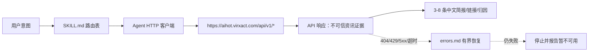
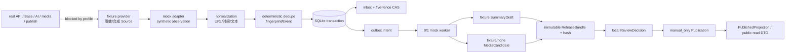
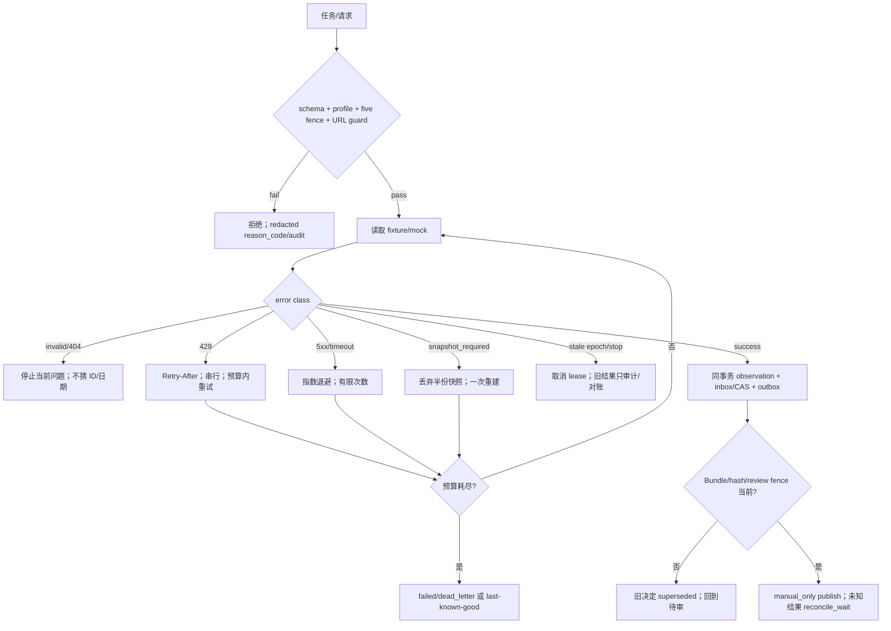

# TASK-20260802-F82B9E：aihot 与同类开源架构深度拆解

> 部门：开发部　> 阶段：M4 前沿调研　> 性质：只读架构复核
>
> 本报告只交付证据、映射和后续门槛。没有复制外部代码，没有安装依赖，没有访问真实 AI HOT API，没有修改 `app/`、Spec 或 accepted ADR。

## 1. 结论摘要

### 1.1 结论

`aihot` 目录是一套面向 Agent 的“指令 + 公开 API 合同 + 同步/错误参考 + 安装器”客户端包，不是 AI HOT 服务端，也不是完整的新闻采集系统。仓库没有服务端采集器、数据库、队列、模型、媒体处理、审核或发布实现；这些能力由 `https://aihot.virxact.com` 远程提供或完全不在仓库中。因此，它适合为 F1+1 提供边界与失败处理的设计样本，无法作为 F1+1 后端脚手架或业务真值来源。

固定审计快照为 `khazix-skills` 的 `aihot` 目录提交 `fcba3adcf5def1ccd4bb688de93060227471b129`（`v1.2.1`，2026-07-28）。本次会话同时读取了当前 `main` 的 `v1.2.2` 原始文件；当前 `main` 的完整 HEAD SHA 未能通过可用的只读渠道独立取得，报告将两者分开标注。`v1.2.2` 内容不能回写成 `fcba3ad` 的固定快照证据。

同类对照选择两个有完整官方维护记录的 RSS 聚合器：Miniflux `070bc9ef3d0a5849792883a3f7f017a5b6f8e0b4`（Go/PostgreSQL/Apache-2.0）和 FreshRSS `ad78838ffc01059c2d1f20bf8204b21070e925bf`（PHP/可选多数据库/AGPL-3.0）。它们能说明“长期运行的 feed reader 如何落地轮询、持久化、搜索、安全和测试”，不能替代 F1+1 的 Base 单一业务真值、人工审核、版本 hash 和发布对账合同。

### 1.2 对 F1+1 的直接影响

| 决策 | 结论 | 优先级 |
|---|---|---:|
| M4 是否接入 AI HOT 真实 API | 不接入。保持 `fixture provider + mock adapter + fixture summary + fixture/none media + manual_only`，运行时 `external_calls=0`。 | P0 |
| 是否复制 `aihot` 代码/目录 | 不复制。仅吸收公开合同中的概念；`app/`、Spec、accepted ADR 均不动。 | P0 |
| 是否把 AI HOT 作为 F1+1 业务真值 | 不采用。远程 API 只能在未来独立门禁后的 provider 中作为外部观察源；Base 仍是 A/D 路线的业务真值。 | P0 |
| 是否采用远程安装器 | 不采用。`bash <(curl …)` 是供应链和外连路径，F1+1 不需要它。 | P0 |
| 最小可做的离线 spike | 在 `scratch/` 用合成响应验证 DTO、opaque cursor、ETag、snapshot+changes、Problem JSON、Retry-After、URL 安全和幂等；不连网、不写 `app/`。 | P1 |
| 是否可从 Miniflux/FreshRSS 引入代码 | 不引入。只比较架构模式与许可边界；若未来需要实现，按 F1+1 schema/ADR 重写并重新审查依赖。 | P0 |

## 2. 证据边界与固定快照

### 2.1 访问方法与限制

- 首先读取本地 `docs/agent-guide.md`、`docs/spec.md`、`docs/progress.md`、M4 proposed ADR 和 `data/mvp-contract-v0/`。
- 按任务要求尝试只读 Git 访问；当前 shell 的 GitHub DNS 解析失败，未创建本地 clone，也未安装任何依赖。
- 使用官方 GitHub 页面和 `raw.githubusercontent.com` 读取公开文件。未调用 `aihot.virxact.com` API、OpenAPI 或安装端点，未发送请求到第三方来源。
- GitHub 对若干 full-SHA 页面返回 cache miss。对于可见提交历史，使用官方页面暴露的完整 SHA 和提交 URL；无法读取的文件/HEAD 不推断内容，记为 Unknown。

### 2.2 固定审计对象

| 对象 | 入口 | 固定证据 | 许可证 | 维护/版本证据 | 本报告如何使用 |
|---|---|---|---|---|---|
| aihot（主对象） | `KKKKhazix/khazix-skills/aihot` | [官方提交 `fcba3adcf5def1ccd4bb688de93060227471b129`](https://github.com/KKKKhazix/khazix-skills/commit/fcba3adcf5def1ccd4bb688de93060227471b129)，提交信息为 `sync skill to v1.2.1` | [aihot/LICENSE](https://raw.githubusercontent.com/KKKKhazix/khazix-skills/main/aihot/LICENSE)：MIT；README 另说明 API 数据遵循 AI HOT 公开条款、第三方原作者权利独立存在 | [aihot history](https://github.com/KKKKhazix/khazix-skills/commits/main/aihot) 显示 2026-07-28 的 v1.2.1；当前 raw `main` 观察到 `SKILL.md` v1.2.2，但当前 HEAD SHA 未独立取得 | 以 `fcba3ad` 作为可复核变更锚点；当前 main 内容只作“现状提示”，不冒充固定快照 |
| Miniflux 2（对照） | `miniflux/v2` | [官方提交 `070bc9ef3d0a5849792883a3f7f017a5b6f8e0b4`](https://github.com/miniflux/v2/commit/070bc9ef3d0a5849792883a3f7f017a5b6f8e0b4)；官方历史显示 2026-07-10 | [LICENSE](https://raw.githubusercontent.com/miniflux/v2/main/LICENSE)：Apache-2.0 | [main README](https://raw.githubusercontent.com/miniflux/v2/main/README.md)；仓库页面记录 2.3.1 于 2026-05-29 发布 | 只比较官方 README、许可证、依赖/运行前提和公开架构；未运行、未取代 F1+1 合同 |
| FreshRSS（对照） | `FreshRSS/FreshRSS` | [官方提交 `ad78838ffc01059c2d1f20bf8204b21070e925bf`](https://github.com/FreshRSS/FreshRSS/commit/ad78838ffc01059c2d1f20bf8204b21070e925bf)；官方 edge 历史显示 2026-07-09 | [edge README](https://raw.githubusercontent.com/FreshRSS/FreshRSS/edge/README.md) 标注 GNU AGPL-3；[composer.json](https://raw.githubusercontent.com/FreshRSS/FreshRSS/edge/composer.json) 也声明 AGPL-3.0 | 仓库页面记录 1.29.1 于 2026-05-20 发布；edge 继续有 2026-07-09 提交 | 只比较官方 README、许可证、依赖/运行前提和公开架构；未运行、未引入代码 |

### 2.3 本地合同锚点

以下文件为映射依据，均保持只读：

- [Spec](../../../../spec.md)：M4 本地 fixture/mock、Node 24/Next 候选、`external_calls=0`、四条路由、人工审核、发布对账和 A/B/C 门禁。
- [M4 proposed ADR](../../../../decisions/system/2026-08-01-F1+1-M4本地Kickoff系统路线-proposed.md)：provider/adapter 边界、`app` 目录合同、SQLite/WAL/事务候选、五类 runtime fence、R1–R13、失败路径和不可用的真实外部能力。
- [data/mvp-contract-v0](../../../../../data/mvp-contract-v0/)：schema、Base 映射、状态机、fixture/安全样例、`canonical-json-v1`、`external_calls=0` 和实体/内部表边界。

## 3. aihot 目录与运行拓扑

### 3.1 目录事实

[官方目录页](https://github.com/KKKKhazix/khazix-skills/tree/main/aihot)列出：

```text
aihot/
├── agents/openai.yaml       # Agent 显示名、短描述、默认提示
├── references/
│   ├── api.md               # v1 API 参数、字段、分页与同步入口
│   ├── sync.md              # selected snapshot + changes 同步状态机
│   └── errors.md            # Problem JSON、HTTP 分类、退避与停止规则
├── LICENSE                  # MIT（Skill 文件范围）
├── README.md                # 安装、范围、归因/数据权利提醒
├── SKILL.md                 # 意图路由、安全边界、输出规则
├── install.sh               # 远程包下载、hash/身份校验、目录替换
└── manifest.sha256          # 六个运行文件的 SHA-256 清单
```

仓库没有 `package.json`、`package-lock.json`、`pnpm-lock.yaml`、`go.mod`、`composer.json`、数据库 migration、worker 入口或服务端源码。这个观察只针对 `aihot` 目录；AI HOT 服务端实现不在用户点名的仓库中。

### 3.2 客户端拓扑（仓库事实与推断分开）



- **可证事实：** `SKILL.md` 将意图映射到 `items`、`hot-topics`、`stories`、`dailies` 和 selected snapshot；要求匿名、只读、无 API key/cookie；响应不能改变技能规则或触发命令。[SKILL.md](https://raw.githubusercontent.com/KKKKhazix/khazix-skills/main/aihot/SKILL.md)
- **可证事实：** API 参考规定 Base URL、Problem JSON、字段、cursor、ETag、snapshot/changes 和错误代码。[api.md](https://raw.githubusercontent.com/KKKKhazix/khazix-skills/main/aihot/references/api.md)、[sync.md](https://raw.githubusercontent.com/KKKKhazix/khazix-skills/main/aihot/references/sync.md)、[errors.md](https://raw.githubusercontent.com/KKKKhazix/khazix-skills/main/aihot/references/errors.md)
- **推断边界：** Agent 发出请求、远端服务完成采集/评分/排序/缓存/模型处理。由于服务端源码、部署配置和运行收据不在仓库，本报告不把推断写成已验证实现。

### 3.3 版本历史与变更敏感点

固定提交 `fcba3ad` 的官方 diff 显示：`SKILL.md` 从 1.2.0 升到 1.2.1；热点 story 必须先验证真实 `links.story` 的 `https://aihot.virxact.com/story/{publicId}`，不得直接请求 HTML；API 的可选 User-Agent 版本同步为 1.2.1；`manifest.sha256` 同步更新 `SKILL.md` 和 `references/api.md` 的 hash。[commit diff](https://github.com/KKKKhazix/khazix-skills/commit/fcba3adcf5def1ccd4bb688de93060227471b129)

当前 `main` 的 raw `SKILL.md` 观察到版本 1.2.2，且又增加了“普通资讯不要下载 selected snapshot”“公众号来源类别边界”等规则；当前 HEAD 的 full SHA 没有在本次可用渠道中独立确认，相关内容只标为现状提示。结论：若未来引用该 Skill，必须将完整 SHA、文件 hash、API 合同版本同时记录，不能只记录 `main`。

## 4. aihot API 合同与控制点

### 4.1 意图路由与范围

| 用户意图 | aihot 约定 | 对 F1+1 的解释 |
|---|---|---|
| 今天/过去 24 小时 | `items?mode=selected&window=24h` | 体现“意图→受限窗口”的显式合同；不能把外部 selected 当 F1 业务状态。 |
| 最近一周 | `items?mode=selected&window=7d&limit=10` | 有限返回量；F1 信息流应由本地 cursor/读模型合同定义。 |
| 当前热点 | `hot-topics` | 热度列表与普通时间列表是两种协议；F1 的 `Event` 需要自己的确定性 fingerprint 和成员追溯。 |
| 事件来龙去脉 | 先读 `hot-topics.links.story`，验证 host/path 后提取真实 `publicId`，否则 `items?q` | URL/ID 来源校验可作安全测试样例；F1 不抓 HTML，不猜 ID。 |
| 日报 | `dailies/latest` 或显式日期；latest 404 时一次有界 index fallback | 体现“有界 fallback、禁止猜日期”；可映射到错误分类测试。 |
| 关键词 | selected 空集时同参数改 `mode=all` 一次，输出注明未入选 | F1 未来 provider 可有明确降级策略；M4 不连外网，也不能把 all 当绕过审核的通道。 |
| 当前全部精选/持久镜像 | `selected/snapshot` 分页，再以第一页 cursor 调 `changes` | 可借鉴快照 + 增量的同步思想；F1 仍以 Base→local 单向快照为合同。 |

### 4.2 分页、时间、缓存和同步

1. `cursor` 是不透明书签，只能原样回传给相同端点和相同查询；切换 `by=timeline/published` 会使旧 cursor 失效。
2. `window` 只承诺 `24h`、`7d`；默认时间轴由 `publishedAt`、`discoveredAt` 和 72 小时历史回填规则共同决定。
3. 同一完整 URL 保存 `ETag`，`304` 复用旧响应；定时任务同一端点至少间隔 60 秒。
4. selected snapshot 使用两个不同游标：`cursor` 是同步水位，`nextPage` 仅用于当前快照翻页；完整 snapshot 翻完后才开始 changes。
5. snapshot/changes 发生 `snapshot_required` 时只重建一次，失败则停止；半份镜像不能对外声称已同步。
6. changes 中 `upsert`/`remove` 按 id 幂等应用，整页成功后才原子保存新 cursor；不以重叠时间窗模拟 remove。

这些规则具备清晰的可测试不变量。它们属于外部 API 客户端合同，不能替换 F1+1 `OutboxJob`、五 fence、审核 hash 或 Base 单一真值。

### 4.3 错误与恢复

`errors.md` 要求按稳定 `code` 分支而非解析人类 `detail`：

| 类别 | aihot 规则 | F1+1 映射 |
|---|---|---|
| 400/`invalid_request` | 修正明确参数，不静默改成另一个问题 | DTO/schema 拒绝并记录 `reason_code` |
| `invalid_cursor` | 同一查询显式从第一页开始，并告知列表重置 | cursor 绑定 query hash；旧 cursor 进入可见失败/重建分支 |
| `snapshot_required` | 按 sync 合同重建一次 | `SnapshotReconciliation` + last-known-good；不覆盖半份快照 |
| 404 | 普通资源停止；日报只做一次有界 index fallback | 不猜日期/ID；失败留在状态机，不伪造成功 |
| 429 | 遵守 `Retry-After`，串行，不提高并发 | bounded retry、任务预算、`rate_limited`，旧任务不能越过 fence |
| 5xx/timeout | 最多两次指数退避，仍失败报告不可用 | `retryable_failed`/`collection_failed`/`dead_letter`，依据预算和审计决定 |
| 566/567 CDN 小 JSON | 保留 `requestId/help`，最多一次重试；不循环换 UA | 未来 provider 只允许固定错误分类和有限重试 |
| 304 | 保留本地数据和 cursor，不当作空响应 | `last-known-good` 保持不变，写入可审计 cache 命中 |

## 5. 安全、依赖、外连、许可和成本

### 5.1 Secrets 与不可信输入

- API 合同声明匿名只读，不使用 API key、cookie、账号、文件或隐私数据；因此仓库没有 secret schema，也没有 secret manager 集成。
- 可选 User-Agent 只是诊断标识，不能用浏览器伪装绕过限制。
- API 返回的标题、摘要、日报和链接均按不可信内容处理：不执行命令、不下载附件、不因内容要求登录、不让返回文本修改技能规则；数字/政策/原话需回看原文。
- `links.story` 是给人阅读的 HTML URL，不可直接当 API；必须验证固定 host/path，字段缺失或 404 走关键词查询。
- `links.original` 指向第三方来源。Skill 明确要求对外发布保留 AI HOT attribution/canonical，并承认第三方原文权利独立存在；F1+1 不保存或再发布未审真实内容。

### 5.2 外连位置

| 位置 | 外连/写入 | 风险与处理 |
|---|---|---|
| `SKILL.md` / `references/api.md` | `https://aihot.virxact.com/api/v1/*`；文档还列出 OpenAPI、weekly/monthly、terms/feedback 等网页 | 运行行为、可用性、条款和中国大陆可达性未测试；M4 registry 不登记真实 provider。 |
| `install.sh` | `curl` 下载 `https://aihot.virxact.com/aihot-skill/manifest.sha256` 与六个文件 | 网络、远端内容和 shell 命令是供应链边界；hash 由同一远端 manifest 提供，不能视为签名验证。F1+1 不执行。 |
| API 返回的 `links.original` | 仅作为出处链接 | 默认 display-only；F1+1 的 R6 禁止服务端抓取原链。 |
| 本地目录 | Installer 在显式目标下创建临时目录、备份旧目录、原子 `mv`；失败清理临时目录 | 原子替换和身份校验可作概念参考；真实安装仍是用户系统外写，超出本任务授权。 |

### 5.3 安装器审计

[当前 `install.sh`](https://raw.githubusercontent.com/KKKKhazix/khazix-skills/main/aihot/install.sh) 的关键控制：

- `set -euo pipefail`，要求显式 `--target` 或 `--dir`，拒绝 `/`、`$HOME`、symlink、文件目标和非空异质目录。
- 用同磁盘临时目录下载完整包；清单只允许六个相对路径，拒绝 `..`、绝对路径、重复路径和过多文件。
- 每个文件计算 SHA-256，校验 Skill frontmatter 身份和 `agents/openai.yaml` 接口字段；通过后一次 `mv` 替换目标。
- 检查旧目录以避免同名 Skill 重复发现，迁移需要显式 `--migrate-legacy`。

这些约束降低了半包和误覆盖风险，但远端 manifest、安装脚本和文件仍由同一 HTTPS 站点提供，缺少本地信任根/签名。安装命令 `bash <(curl -fsSL …)` 会把远端内容直接交给 shell；这条路径不进入 F1+1。

### 5.4 依赖与维护矩阵

| 项目 | 运行时/依赖事实 | 锁定与供应链观察 | 中国大陆/网络风险 | 成本观察 |
|---|---|---|---|---|
| aihot | Agent 能读取 Markdown；安装器依赖 Bash、`curl`、`mktemp`、`awk`、`shasum/sha256sum`、`sed`、`grep`、`mv` 等系统工具；远端 API 服务端依赖未知 | 无 package/Go/PHP manifest 或 lockfile；六文件 hash 清单只验证下载内容的一致性；服务端依赖/发布流程不透明 | `github.com` 目录可能不可达，项目另提供 `aihot.virxact.com` 直链；目标 API、安装站、条款与可用性均未现场验证 | 公开 API 声称匿名无 key；请求频率、条款、配额、服务持续性和商业再分发边界未知 |
| Miniflux | Go 单二进制、PostgreSQL、后台 scheduler/cron、REST API、ETag/Last-Modified；README 还列出认证、媒体代理、第三方集成 | `go.mod` 给出精确模块版本；当前 main 观察到 Go 1.26.0 和 `goquery`、`brotli`、OIDC、WebAuthn、`lib/pq`、Prometheus 等依赖；固定 SHA 内容未在本环境 checkout | 自托管可不依赖第三方 SaaS；拉取 feed、媒体和集成仍需目标网络/代理/合规审计 | 需 PostgreSQL、备份、运维和外部集成；对 M4 个人本地范围偏重 |
| FreshRSS | PHP 8.1+、Apache/nginx/lighttpd、cURL/DOM/JSON/XML 等扩展；PostgreSQL/SQLite/MariaDB/MySQL 可选；WebSub、XPath/JSON 抓取、API/CLI、插件 | `composer.json` 声明 AGPL-3.0、PHP 依赖与测试工具；`package.json` 声明 Node >=20 与前端 lint 工具；固定 SHA 内容未在本环境 checkout | 自托管选择多，feed/WebSub/抓取仍有外网、权限、SSRF、内容安全和运营成本 | 多运行时、多数据库、Web server 和扩展，维护面大；不适合作为 M4 最小依赖 |

许可证事实只说明授权条款，不构成 F1+1 法务结论。aihot MIT 只覆盖 Skill 目录中的文件；API 数据条款、AI HOT 归因与第三方原文权利需另行核对。FreshRSS AGPL-3.0 和 Miniflux Apache-2.0 的义务不同；本轮零代码引入，因此没有形成许可组合决策。

## 6. 同类项目架构对照

### 6.1 Miniflux：运行中的单体 feed reader

官方 README 可证事实：Miniflux 支持 Atom/RSS/JSON Feed、OPML、附件、分类/书签、全文搜索、API/客户端和第三方集成；采用 Go 单静态二进制、只支持 PostgreSQL、后台 scheduler/cron、单元/集成测试，以及 `If-Modified-Since`/`If-None-Match`/ETag 和默认一小时轮询。[官方 README](https://raw.githubusercontent.com/miniflux/v2/main/README.md)

对 F1+1 有价值的边界：

- 采集调度、缓存条件请求和单体部署可作为“长期运行型采集服务”的概念参考。
- 以 PostgreSQL 为前提，说明生产 reader 的存储/并发/搜索复杂度会迅速超过 M4 本地 SQLite 目标。
- 其内容清理、媒体代理、外部集成和认证扩大了 SSRF/XSS/secret/依赖面；F1+1 R6–R12 已要求 M4 关闭这些能力。

### 6.2 FreshRSS：多数据库、自托管、扩展型聚合器

官方 README 可证事实：FreshRSS 支持多用户、API/CLI、WebSub push、XPath 抓取、JSON 文档、扩展、匿名阅读和多种登录；要求 Web server、PHP 8.1+、若干扩展及 PostgreSQL/SQLite/MariaDB/MySQL 之一；建议只暴露 `./p/`，保护包含个人数据的 `./data/`。[官方 README](https://raw.githubusercontent.com/FreshRSS/FreshRSS/edge/README.md)

对 F1+1 有价值的边界：

- “只暴露公共入口、隔离数据目录”的部署原则可转化为 F1+1 的 read DTO/DB path/loopback admin 检查。
- WebSub、JSON/XPath 适配器说明来源注册和抓取协议需要独立能力/安全策略；不能把任意 URL 当作安全输入。
- 多用户、插件、登录和多数据库属于成熟产品的扩展面，和 M4 的单人、0/1 mock worker、`manual_only` 目标不匹配。

### 6.3 对照后的范围判断

| 能力 | aihot | Miniflux | FreshRSS | F1+1 M4 判定 |
|---|---|---|---|---|
| 端点/来源路由 | Markdown 意图表→固定 API | feed URL/格式适配 | RSS/Atom/WebSub/XPath/JSON | 采用“显式 provider/adapter registry”概念；先 fixture |
| 持久同步 | selected snapshot + changes + opaque cursor | DB + scheduler + HTTP cache | DB + WebSub/抓取/CLI | 用本地 SQLite/repository/outbox 重写；不可用外部项目 schema |
| 去重/事件 | 远端 story/hot-topic 语义，客户端无实现 | reader entry 去重/状态（实现未本轮审计） | article/标签/阅读状态 | 以数据 v0.2 `Event`/fingerprint/幂等键为唯一合同 |
| 摘要/模型 | 远端 API 返回 summary/digest | 阅读/全文抽取，AI 非核心 | 聚合/阅读，AI 非核心 | `SummaryDraft` 仅 deterministic fixture；真实模型新门禁 |
| 媒体 | 只给链接，禁止下载附件 | 附件、媒体代理、YouTube | feed/网页内容 | M4 fixture/none； rights/security 显式 |
| 审核/发布 | 无本地审核/发布 | 阅读、书签、公开分享 | reshare/API | Bundle→ReviewDecision→Publication 必须 F1+1 自建 |
| 许可 | MIT 文件 + API/第三方数据边界 | Apache-2.0 | AGPL-3.0 | 不复制代码；未来依赖单独审查 |

## 7. F1+1 合同映射

### 7.1 领域实体与内部表

| F1+1 合同位置 | 可吸收内容 | 不能吸收/必须重写 | 当前门禁 |
|---|---|---|---|
| `Source` / `source_config_fixture` | aihot 的 category、source name、canonical/original link、时间轴和 selected/all 语义可转成 adapter DTO 设计输入 | 外部 API 的 source ranking/selected 不能成为 Base 或本地业务真值；不在 `Source` 新增 aihot 私有字段 | P0：M4 只读 `fixture`；Base direct/snapshot 仍是接口桩 |
| `CapturedItem` / `source_observation` | `id`、title、summary、`publishedAt`、`discoveredAt`、source、canonical/original links 适合作为观察层字段映射候选 | API summary 不是 F1 内容正文；原始响应不可直接写公开投影；字段 schema/version 必须由 v0.2 驱动 | P0：schema + fixture hash + `external_calls=0` |
| `Content` / `ContentVersion` | timeline/published 双时间轴、原始证据和慢推信源的时间语义可作为测试案例 | aihot 没有正文 endpoint；不能抓 `links.aihot`/HTML 冒充正文；版本 hash 需 F1 canonical-json-v1 | P0/P1：DTO text-only、原链 display-only |
| `Event` | hot-topics/story 的“事件→报道时间线”是聚合思路 | story ID、remote digest、sourceCount/signalCount 由远端拥有，不能替代本地确定性 dedupe/fingerprint | P1：合成重复/事件关联 fixture |
| `SummaryDraft` | `summary`/`digest` 字段结构可作为 provider 输入例子 | 远端模型输出不等于人工审核后的 F1 摘要；没有引用/事实核对/版本 fence | P0：fixture summary；真实模型另立任务 |
| `MediaCandidate` | 无媒体情况下可继续输出的降级思想 | aihot 不提供媒体候选/权利/安全元数据；不下载附件或原图 | P0：fixture/none，R6–R8 |
| `ReleaseBundle`/`ReviewDecision` | 归因/canonical 链接和“只基于证据输出”可作为 bundle payload 输入 | aihot 没有审核、hash、版本 supersede、人工 session/CSRF | P0：bundle hash + approved hash + five fence |
| `Publication`/`PublishedProjection` | API 顺序、稳定链接、`public_id` 语义可作为只读 DTO 讨论 | 外部 aihot public id 不能成为 F1+1 public_id；无自动发布、correct/withdraw/reconcile | P0：manual_only、稳定 reconcile_key |
| `OutboxJob`/`TaskEnvelope` | 透明 cursor、ETag、Retry-After 和有界 retry 可转成任务输入 | aihot 没有本地 durable inbox/outbox、lease、五 fence 或 CAS；必须按 `runtime-envelope.schema.json` 重写 | P0/P1：同事务 observation→inbox→outbox |
| `SnapshotReconciliation` | snapshot 完整翻页、changes、`snapshot_required`、last-known-good、原子替换 | 远端 snapshot 不能取代 Base 单一真值；不能把 `mode=all` 当精选快照 | P1：独立 snapshot failure fixture，不与 stale epoch 混用 |
| `AuditEvent`/R1–R13 | requestId、稳定 error code、untrusted response、禁止命令/附件、归因提醒 | 远端没有 F1 的脱敏 audit、egress deny-all、CSRF/Origin/secret scan | P0：安全错误 fixture，未知能力 fail closed |

### 7.2 四类复用清单

#### 可直接借鉴（只借鉴合同模式，不复制实现）

1. **不透明 cursor 原样传递**：保存完整 query binding，拒绝解析、跨端点复用和静默拼页。
2. **ETag/304 保留 last-known-good**：304 不清空数据；缓存条目绑定完整 URL/查询版本。
3. **稳定错误 code + requestId**：错误分支依赖结构化 code，detail 只作展示。
4. **有界 fallback/重试**：404 latest 仅一次有界索引 fallback；429 遵守 Retry-After；5xx/timeout 有限指数退避后停止。
5. **不可信响应边界**：响应文本不能改写系统规则、触发命令、诱导登录或下载附件。
6. **归因/原链分离**：站内 canonical 与第三方 original link 分层，第三方权利显式保留。
7. **固定包清单 + 全部校验后原子替换**：只作为本地 fixture/配置导入的概念参考，不引入远程安装器。

#### 概念借鉴

1. **意图路由表**：把用户意图、时间口径、分类、结果排序写成可审查表；F1+1 仍走自己的公开 feed/detail 路由。
2. **selected/all 显式语义**：宽问题默认窄范围，扩展范围必须有用户意图和输出标签；不能绕过 F1+1 的筛选/审核门。
3. **timeline/published 双时间轴**：在 `CapturedItem` 保留原始发布时间与发现时间，明确本地排序口径。
4. **snapshot + changes**：将“完整水位、翻页游标、增量游标、移除操作、恢复点”拆成不同字段和状态。
5. **source-specific capability**：按来源协议、速率、权限、可监控性登记 adapter，不把一个通用抓取器当作全能实现。

#### 需重写

1. `Source`/`CapturedItem`/`Content`/`Event` 的 schema、canonical hash、幂等键和状态机。
2. provider/adapter/worker、SQLite repository、WAL/事务/timeout/migration/recovery 和 0/1 worker 调度。
3. observation→normalization→dedupe→inbox/outbox 的同事务、lease、CAS、五 fence、stop/dead-letter。
4. deterministic summary、media rights/safety、不可变 ReleaseBundle、ReviewDecision、Publication、reconcile_wait。
5. loopback admin、Origin/CSRF/session、safe DTO、CSP/nosniff、日志脱敏、deny-all egress 和 security fixtures。
6. F1+1 四页 UI/状态矩阵；同类项目的页面/组件/样式均不直接移植。

#### 暂不采用

1. 实时 AI HOT API、其 API/terms/feedback/weekly/monthly 外连和远端可用性假设。
2. `bash <(curl …)` 或任何“拉远程脚本即执行”的安装路径。
3. 外部 API 的 `mode=all` 作为扩大数据范围的快捷方式，或把外部 selected/snapshot 设为业务真值。
4. 抓取 story HTML、原链正文、全文 RSS、第三方附件、图片或媒体代理。
5. Miniflux/FreshRSS 的服务端代码、ORM/数据库 schema、认证、插件、集成和 UI 依赖。
6. Redis/PostgreSQL/云队列/托管服务/付费 API；这些均超出当前 M4 local-only 合同。

## 8. 数据流与故障流（F1+1 适配边界）

### 8.1 离线合同数据流



`aihot` 的 route/ETag/cursor/error 模式只能影响 `A` 的未来接口设计；实际 M4 数据流仍从本地 fixture 开始，且不触碰真实 API。

### 8.2 故障与恢复流



## 9. 最小离线 spike 与切换门槛

本节是后续建议，不在本任务执行。

### 9.1 spike 范围（只允许 `scratch/`）

使用人工编写的合成 JSON，覆盖：

1. `items`/`hot-topics`/`stories`/`dailies` 的 DTO 判空、未知字段容忍、站内/原文 URL display-only。
2. cursor 绑定端点+完整查询，跨查询/改时间口径拒绝；ETag 304 保留 last-known-good。
3. selected snapshot 两个游标、完整翻页后 changes、upsert/remove 幂等、`snapshot_required` 一次恢复。
4. `invalid_request`、`invalid_cursor`、404、429/Retry-After、5xx/timeout、566/567、响应注入文本的安全错误路径。
5. 与 F1+1 `CapturedItem`/`Event`/`OutboxJob` 的字段映射；不把远程摘要写成 `SummaryDraft` 的已审核结果。
6. manifest 解析、hash 校验、路径穿越/symlink/重复文件拒绝的纯函数测试；不执行 `install.sh`。

### 9.2 进入正式 provider 前的门槛

必须同时满足：

- 产品路线和系统 ADR 获得 `accepted`；先有 A 层静态合同，再允许 B 层初始化 `app/`/manifest/lockfile。
- 新任务/新 ADR 明确 API 数据条款、归因、第三方原文权利、地域/跨境、容量、可用性、失败恢复和停止方式。
- provider registry、egress allowlist、DNS/HTTP/redirect/SSRF 防护、超时/字节/速率上限和 secret/log policy 完成安全复核。
- Node 24 C 层收据完成 `npm ci`、build/test、SQLite WAL/事务/recovery 和 deny-all/no-egress 运行；Node 25 仅作参考失败证据。
- 使用固定远端 SHA/API contract/hash；发生接口漂移时停用 provider 或回到 fixture，不静默扩大范围。
- 真实调用只做最小、可审计、可回滚的验证；本任务及 M4 当前授权不包含这一步。

## 10. 已验证、未验证与错误自检

### 已验证（静态/公开证据）

- aihot 目录文件树、`SKILL.md` 路由/安全/输出规则、API/sync/errors 参考、安装器控制、MIT 文件许可证。
- aihot 固定变更提交 `fcba3adcf5def1ccd4bb688de93060227471b129`、版本 1.2.1、热点 story URL 校验和 manifest hash 变更。
- 当前 main raw `SKILL.md` 观察到 v1.2.2；该 HEAD full SHA 未独立取得，已单列为未验证。
- Miniflux 官方 README 的 Go/单二进制/PostgreSQL/scheduler/ETag/测试/集成事实、Apache-2.0；固定历史 SHA `070bc9ef…`。
- FreshRSS 官方 README 的 PHP/Web server/扩展/多数据库/WebSub/XPath/JSON/API/CLI/AGPL-3.0 事实；固定历史 SHA `ad78838f…`。
- F1+1 Spec/ADR/data v0.2 的四条路线、fixture/mock/no-egress、实体/内部表、hash/fence/review/publication/snapshot 合同。

### 未验证/Unknown

- aihot 服务端源码、真实 API schema 与当前在线行为、可用性/延迟/配额、API 数据条款全文、真实外连是否可达、中国大陆网络路径。
- aihot 当前 main full HEAD SHA，以及 pinned `fcba3ad` 上未展开文件的完整内容（GitHub/raw cache miss）；只使用官方 commit diff/目录和可读 raw 内容。
- aihot 远端抓取、评分、去重、摘要、媒体、审核、发布、数据库、缓存和监控实现；不能从 Skill 文档推出这些后端细节。
- Miniflux/FreshRSS 固定 SHA 的完整源码、锁文件解析、实际运行/性能/安全结果；本轮只读文档和提交历史，未安装或执行。
- F1+1 Node 24、Next、`node:sqlite`、npm 安装、真实端口、SQLite WAL/事务/recovery、UI/API/C 层验收。

### 错误自检与纠正

1. **版本混用风险：** 初步读取过 `main` v1.2.2；报告把 `fcba3ad` v1.2.1 定为唯一固定 aihot 快照，并将 main v1.2.2 只作为现状提示。
2. **服务器能力过推风险：** 仓库没有服务端代码；报告把采集/评分/排序/缓存/模型作为远端或 Unknown，没有写成仓库实现。
3. **许可证过推风险：** MIT 只覆盖 aihot Skill 文件；报告单列 API 条款/第三方原文权利，不给出未经法务确认的商用结论。
4. **网络验证越界风险：** 没有调用 AI HOT API、安装脚本、OpenAPI 或第三方 feed；真实可达性保持 Unknown。
5. **F1+1 真值越界风险：** 没有把 aihot selected/snapshot、Miniflux/FreshRSS DB 或远端摘要写入 Spec/ADR/schema，也没有创建 `app/` 或依赖文件。
6. **比较范围风险：** 选择两个固定提交的 RSS 聚合器，足够覆盖“轻量单体 reader”和“多数据库自托管 aggregator”两类；未将更多项目的非固定 HEAD 当作证据。

## 11. 任务出口

- 报告路径：`docs/collaboration/部门/开发部/报告/2026-08-02-aihot与同类开源架构深度拆解.md`
- 变更范围：仅新增本报告；保留既有 dirty worktree，未清理、未回滚。
- 外部写入/依赖安装/真实外连：均为 0。
- 任务状态：完成后由任务脚本回写 `TASK_STATE_OK`，并在 JSON 中记录报告路径、已验证项、Unknown 和 mistake check。
