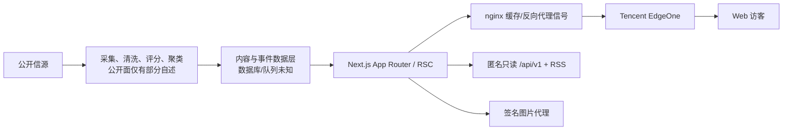

## 背景

F1+1 当前处于 Spec v0 的 M1 需求澄清与 M2 风险调研阶段。本任务对 [AI Hot 指定页面](https://aihot.virxact.com/all?page=2&anchorAt=1784285499568) 及其公开可访问页面做只读、低频、非侵入式调研，目的是拆解产品能力、公开请求、分页与图片行为、前端和部署信号，并判断哪些模式可供 F1+1 后续设计参考。

取证时间为 2026-07-30，页面内容、构建版本、缓存状态和证书信息均是当时快照。没有登录、提交反馈、写入收藏、绕过认证或反自动化、枚举未公开资产、探测漏洞或调用付费接口。

本报告使用三类证据标签：

- **直接证据**：公开页面、DOM、静态资源、响应头、DNS、公开 API 或站方公开说明可直接复核。
- **合理推断**：由多条直接证据推导，附置信度；不等同于站方确认。
- **无法确认**：公开面不足以回答，必须依靠站方披露或在 F1+1 自建系统中验证。

浏览器自动控制在部分页面读取时超时，随后按任务失败路径改用公开 HTML、Defuddle 文本提取、低频 HTTP 请求、DNS 与公开静态资源。不同请求环境分别观察到 403 与 200；由于环境不等价，403 成因无法确认，也没有做归因或绕过验证。

## 结论

1. **产品核心是双层信息流加阅读闭环。** 首页负责“精选和热点”，`/all` 负责全量浏览与搜索，详情页负责中文摘要、正文或原文入口、相关报道与收藏。日报、周报、月报、主题、Agent 接入属于扩展层。
2. **公开前端栈可高置信确认。** 响应头、构建路径和 RSC 载荷共同支持 Next.js App Router、React Server Components、服务端渲染/流式输出与客户端增强；不能据此反推出数据库、ORM 或后台服务拓扑。
3. **分页采用两套公开可见机制。** 服务端页面暴露页码和可选 `anchorAt`；客户端继续加载使用 `{cursorAt,cursorId}` 复合 keyset 游标、稳定 ID 去重、单请求在途控制、错误重试与有限自动加载。带锚点与无锚点的两个样本出现明显时间截面差异；是否由 `anchorAt` 导致及其正式语义待复测。
4. **公开 API 与站内接口已有分层。** `/api/public/feed` 是站内翻页接口；对外稳定能力放在匿名只读 `/api/v1/*`，有 OpenAPI、schemaVersion、ETag、缓存合同、游标、snapshot/changes 增量同步和迁移说明。
5. **图片代理有可见的基础防护信号。** URL 带 `mode`、`exp`、`sig`，响应统一转为 WebP 并缓存；签名算法、来源白名单、重定向复核、私网阻断、大小/超时限制和恶意内容处理无法确认。
6. **F1+1 值得学习的是信息分层、来源证据、双时间轴、事件去重、稳定游标、错误出口与可恢复增量合同。** 日/周/月报、38 个主题、分享海报、Markdown 导出、Skill/API 接入会明显扩大 MVP，应由统筹部在核心阅读闭环验证后逐项裁决。
7. **不能把公开表现当作后端、安全和稳定性证明。** 数据库、队列、采集器、LLM、审核权限、审计、容灾、备份、限流额度、WAF、成本和 SLA 均未得到公开证据。

## 一、产品与信息架构

| 入口 | 公开可见能力 | 证据性质 | 对 F1+1 的意义 |
|---|---|---|---|
| [精选首页](https://aihot.virxact.com/) | 今日热点 TOP 5、同时报道信源数、最新精选、分类、日期时间线 | 直接证据 | 用少量高价值内容承担首屏决策效率 |
| [全部动态](https://aihot.virxact.com/all) | 搜索、来源/类型/标签筛选、日期分组、评分、摘要、媒体、相关信源、收藏、40 条分页 | 直接证据 | 适合检索和深度浏览；F1+1 上线初期仍须保证未经审核内容不公开 |
| [站内详情](https://aihot.virxact.com/items/cmrolmt6904l3bitoai8kxmas) | 来源、评分、标题、时间、AI 摘要、正文或原文、标签、同事件报道、分享海报、Markdown 导出、收藏 | 直接证据 | 完成“中文提炼 → 上下文 → 原始信源”的阅读闭环 |
| [日报](https://aihot.virxact.com/daily) / [周报](https://aihot.virxact.com/weekly) / [月报](https://aihot.virxact.com/monthly) | 主线摘要、分组、统计、阅读时长、历史归档 | 直接证据 | 有复盘价值，但内容生产和审核成本高，宜后置 |
| [主题地图](https://aihot.virxact.com/topics) | 38 个主题，按公司与模型、技术方向、内容形态分组，进入主题近期焦点和时间线 | 直接证据 | 适合内容量稳定后做长期追踪，不属于当前核心闭环 |
| [本机收藏](https://aihot.virxact.com/starred) | 当前浏览器收藏、空状态、移除收藏；换设备或清数据后不保留 | 直接证据 | 可作为无账号轻量方案，不能承载审核或跨设备关键状态 |
| [Agent 接入](https://aihot.virxact.com/agent) | Skill、RSS、REST API、迁移和轮询说明 | 直接证据 | 是成熟后的分发能力，不应提前扩大 MVP |
| [反馈](https://aihot.virxact.com/feedback?from=%2Fall) | 2000 字反馈、邮箱选填、匿名提交 | 直接证据 | 可借鉴低门槛反馈入口；本次未提交表单 |

### 核心用户流程

1. **快速追热点**：精选首页 → TOP 5 或最新精选 → 分类 → 详情摘要/正文 → 原文。
2. **全量查找**：全部动态 → 搜索、来源、类型或标签 → 日期时间线 → 下一页/继续加载 → 详情或原文。
3. **核对同一事件**：主卡片 → “另有 N 家信源报道” → 查看相关来源或详情页的同事件列表。
4. **周期复盘**：日报 → 指定日期；或周报/月报 → 主线与主题 → 单条详情。
5. **稍后阅读**：信息流或详情收藏 → 本机收藏页 → 移除；数据只在当前浏览器保存。
6. **机器接入**：Agent 接入 → Skill、RSS 或 `/api/v1/*`；与普通访客阅读路径分离。

### 卡片与详情字段

指定页面直接展示或序列化了：

- 时间、来源名、作者、X handle、标题、中文标题/摘要、原文 URL；
- 0–100 分显示、精选状态、精选理由、标签；
- 头像、图片和视频缩略图；
- `duplicateCount`、`duplicateSources`、`linkedPrimary` 等事件去重/主条目关系；
- 同事件多源报道及来源列表；
- `qualityScore` 与 `finalScore` 等内部 UI 投影字段。

这些字段只能证明**公开 DTO/页面投影存在**，不能证明数据库表结构、评分算法、聚类模型或人工复核规则。

### 页面状态与渐进增强

公开 HTML 和静态资源可直接确认以下状态：

- 搜索输入为 GET 参数 `q`，最短 2 个字符；来源、类型和标签进入 URL，可组合、刷新和分享。
- 继续加载状态包含“加载中”“加载失败，点击重试”“加载更多”“没有更多了”和已加载数量。
- 收藏页有加载骨架、空状态、列表和移除动作；存储不可用时提示“收藏未保存”。
- 日期分组支持折叠/展开；无 JavaScript 时提供“下一页”链接。
- 详情访问前把来源路径临时写入 `sessionStorage`，有效期代码为 30 分钟；桌面宽度达到 961px 时卡片可能新标签打开，移动端在当前页导航。
- 详情页公开 DOM 的固定入口文案为“返回精选列表”；从 `/all` 进入后是否通过浏览器返回、`sessionStorage` 或客户端逻辑完整恢复筛选、页码和锚点，没有完成动态复测。详情返回路径应保留为待复测，不能据文案直接认定上下文必然丢失。
- 主题支持浅色、深色、跟随系统；已读状态、收藏和更新日志提示均有本机存储信号。

本机存储键在公开代码中可见：

- `aihot-starred-items`：最多保存 500 条经裁剪的收藏投影；
- `aihot-read-items`：已读条目；
- `aihot-theme`：主题偏好；
- `aihot-changelog-seen-version`：更新日志已读版本。

收藏写入、主题切换、分享海报和反馈提交会产生本机或外部状态，本次遵守只读边界，没有执行。

## 二、指定页面、分页与公开网络行为

### 指定锚点页

- 目标 URL 的 `anchorAt=1784285499568` 对应 2026-07-17 18:51:39（Asia/Shanghai）。
- 该响应首屏为 7 月 17 日内容，40 条，`initialHasNext=true`，末游标为 `{at:1784263431776,id:"cmrogdo9k02zcbitokz7sdobs"}`。
- 同一取证窗口访问无锚点 `/all?page=2`，内容已位于 7 月 30 日，末游标为 `{at:1785395117247,id:"cms765o1x03yqro8wchyqc204"}`。

**合理推断（置信度 0.70，待复测）**：`anchorAt` 用于固定历史翻页的时间截面，随后客户端转为 `{at,id}` 复合 keyset 游标。公开页面没有给出 `anchorAt` 合同，不能把这一推断写进 F1+1 的接口设计依据。

目标页的 `<noscript>` 下一页为 `/all?page=3`，没有携带 `anchorAt`。这直接证明降级链接缺少该参数；客户端实际点击是否补参未验证。应把它作为高优先级复测项，不能直接认定为线上事故。

### 站内继续加载

公开 chunk [7096-7d46bb56e71d3e83.js](https://aihot.virxact.com/_next/static/chunks/7096-7d46bb56e71d3e83.js) 可复核：

- 请求 `/api/public/feed`；
- 参数为 `mode`、`channel`、`q`、`tag`、`category`、`cursorAt`、`cursorId`；
- 同时只允许一个在途请求；
- 追加前按稳定 `id` 去重；
- 响应读取 `items`、`hasNext`、`nextCursor`；
- 失败后保留人工重试；
- 自动加载 6 次后转成“加载更多”按钮。

使用目标页公开末游标低频复核一次，接口返回 40 条、`hasNext=true` 和下一个 `{at,id}` 游标。该接口被站方接入页明确称为“站内网页翻页接口”，不应成为 F1+1 或第三方客户端的外部依赖。

### 图片代理

公开页面将外链头像与媒体改写为：

```text
/api/img-proxy?u=<编码后的来源 URL>&mode=<avatar|thumb|full>&exp=<Unix 时间>&sig=<签名>
```

样本响应为 `image/webp`，包含 `x-img-proxy-sig: valid`、缓存命中和近一天的 immutable 缓存。

**合理推断（置信度 0.90）**：签名与过期时间用于限制任意客户端构造代理请求，`mode` 用于尺寸/用途转码。

**无法确认**：URL allowlist、重定向后重新校验、DNS rebinding、私网和元数据 IP 阻断、下载/解压上限、超时、MIME 嗅探、SVG 处理、恶意内容扫描与缓存键规范化。存在签名不能证明 SSRF 风险已经完整解决。

## 三、公开 API 与数据合同

站方提供 [OpenAPI 3.1 文档](https://aihot.virxact.com/openapi-v1.json)，描述其为匿名、只读、无需 API key 的稳定 v1 接口，并在 [Agent 接入页](https://aihot.virxact.com/agent?tab=api) 公开调用、轮询、迁移和错误处理建议。

### v1 端点

- `GET /api/v1/items`：精选或最近 7 天公开池，支持分类、时间窗、关键词和游标；
- `GET /api/v1/hot-topics`：多源热度事件；
- `GET /api/v1/stories/{publicId}`：事件详情；
- `GET /api/v1/dailies`、`/latest`、`/{date}`：日报索引与详情；
- `GET /api/v1/selected/snapshot`：完整精选首次同步；
- `GET /api/v1/selected/changes`：精选新增、修改和撤选增量。

`/api/v1/items?mode=selected&window=24h&limit=2` 的样本直接返回：

- 顶层：`schemaVersion`、`query`、`items`、`page`；
- Item：`id`、`title`、`originalTitle`、`summary`、`source.name`、`links.aihot`、`links.original`、`publishedAt`、`discoveredAt`、`category`、`score`、`selected`、`attribution`；
- Page：`count`、`hasMore`、不透明 `nextCursor`。

这里最值得 F1+1 借鉴的是 `publishedAt` 与 `discoveredAt` 双时间轴：前者表达来源事件时间，后者用于采集 SLA、慢推信源和积压判断。F1+1 还需要补充处理、审核与公开发布时间，才能完整测量 15 分钟目标。

### 缓存、条件请求与恢复

- `/api/v1/items` 样本返回 `ETag`、`Cache-Control: public, s-maxage=60, stale-while-revalidate=300`、CORS `*`，只允许 `GET/HEAD/OPTIONS`；
- 使用同一 ETag 发出 `If-None-Match` 条件请求，直接复核得到 304 空响应；
- 站方明确没有 SSE、Webhook 或 streaming，要求按 `s-maxage` 条件轮询，遇到 429/503 遵守 `Retry-After`；
- `snapshot + changes` 使用 `upsert/remove + changedAt`；无法继续增量时返回 409 `snapshot_required`，客户端重新完整同步；
- 滚动 24h/7d 查询游标绑定查询和移动窗口，完整镜像必须使用 snapshot/changes，不能混用两类游标。

旧外部 `/api/public/*` 公告于 2026-12-31 停服；RSS URL/GUID 和站内 `/api/public/feed` 不在本轮停服范围。这个安排直接体现“内部 UI DTO / 版本化外部 DTO”分层。

[公开接入条款](https://aihot.virxact.com/terms) 允许合理私人缓存和有独立价值的客户端，但要求公开展示时保留署名与 canonical；不默认授权纯镜像、换皮、批量公开再分发，也不转移第三方原文和图片权利。F1+1 可以学习模式，不能复制其数据、文案、评分逻辑或媒体资产。

## 四、前端、部署与缓存信号

| 观察 | 结论 | 置信度与边界 |
|---|---|---|
| `x-powered-by: Next.js`、`/_next/static/`、`self.__next_f.push`、`Vary: rsc, next-router-*`、`(app)` route group | Next.js App Router + React Server Components + SSR/流式输出与客户端增强 | 0.99；不能反推出数据库或后端拆分 |
| DNS CNAME `aihot.virxact.com.eo.dnse2.com`，响应含 `EO-Cache-Status` 与 `EO-LOG-UUID` | Tencent EdgeOne 位于公网入口 | 0.99；[EdgeOne 官方响应头说明](https://edgeone.ai/document/54212) 可交叉复核 |
| `server: nginx/1.24.0 (Ubuntu)`、`x-nginx-cache` | EdgeOne 后方可观察到 nginx 反向代理/缓存信号 | 0.90；实例数、容器、负载均衡和源站拓扑未知 |
| 页面、API、静态资源均出现 `x-aihot-release: 72b5cfdd9f027e90d8b1246ed758f2cda5de39c7` | 存在统一发布版本标识 | 0.98；是否为源码 commit SHA 未确认 |
| HTML 300 秒共享缓存 + 900 秒 SWR；API items 60 + 300；content-hash 静态资源一年 immutable | 至少存在边缘与应用侧缓存的可见分层 | 0.90；具体缓存实现和失效机制未知 |
| [Web App Manifest](https://aihot.virxact.com/manifest.webmanifest) 为 standalone、含图标和主题色 | 支持可安装/PWA 风格壳层 | 0.95；未发现足够证据确认 Service Worker 或离线能力 |

可见链路可画成：



AI Hot 站内一篇由运营者来源发布的公开内容自述了“结构化处理 → 实体提取 → 预筛 → 正文清洗 → 精选评分 → 向量化 → 事件聚簇 → AI 摘要”和并发队列事故。这只能作为**运营者公开自述、置信度中等**的线索，不能替代对真实后台实现、当前版本和容量的验证。

## 五、安全与稳定性观察

### 直接观察到的正向信号

- `Strict-Transport-Security: max-age=31536000; includeSubDomains`；
- `X-Frame-Options: SAMEORIGIN`；
- `X-Content-Type-Options: nosniff`；
- `Referrer-Policy: strict-origin-when-cross-origin`；
- `Permissions-Policy: camera=(), microphone=(), geolocation=()`；
- 匿名 API 只读方法、参数边界、ETag、Problem JSON、requestId 和 Retry-After 合同；
- 图片代理的签名、过期时间、转码和缓存信号；
- `rawJson` 在公开样本为 null，说明样本没有把完整上游原始包直接下发。

### 只构成加固建议的缺口

- 采样 HTML 未见 `Content-Security-Policy`、COOP、COEP 或 CORP。这不能证明站点存在 XSS 漏洞；F1+1 聚合外部文本、链接与媒体，应从首版设计 CSP、上下文输出编码和富文本白名单清洗。
- 精确 nginx 版本、Next.js 标识和完整 release 值增加技术指纹暴露。release 标识有排障价值，公网可使用不暴露源码语义的短发布 ID。
- RSC 公开载荷包含内部评分、精选理由和来源专用展示字段。F1+1 应最小化前端 DTO，把原始采集包、审核备注、提示词、密钥和详细失败原因留在服务端。
- 匿名 CORS `*` 适用于公开只读 API，后台审核、信源管理和运维接口不能沿用。
- CDN 缓存会影响“内容已发布”和“访客已可见”之间的时间。采集、处理、审核、发布、缓存失效与外部可见必须分别计时。

### 无法确认的后端、安全与基础设施细节

- 数据库、ORM、缓存产品、队列产品、调度器与实例拓扑；
- 采集器、平台 API、LLM 供应商、提示词和去重/评分算法；
- 审核后台、登录方式、RBAC、会话、审计日志和密钥管理；
- 备份、恢复、跨区容灾、监控、告警、成本和容量；
- WAF/限流规则、具体配额、反滥用策略和 SLA；
- 图片代理的完整 SSRF、防资源耗尽和恶意内容控制。

## 六、可借鉴与不应照搬

### 建议优先借鉴

1. **阅读闭环**：白名单来源 → 中文提炼 → 人工审核 → 精选信息流 → 站内详情 → 原文。
2. **内容证据**：稳定 ID、来源、作者、原发布时间、系统发现时间、原文 URL、站内 canonical 同时保存。
3. **事件去重**：主条目 + 其他来源 + 重复数，优先展示更接近一手事实的代表来源。
4. **双层内容投影**：规范化 canonical item、来源专用展示投影、版本化外部 DTO 分离。
5. **稳定分页**：复合 keyset cursor、客户端按 ID 去重、限制单请求在途、明确加载/错误/重试/结束状态。
6. **可恢复同步**：OpenAPI、schemaVersion、ETag、s-maxage、Retry-After、Problem JSON/requestId、snapshot + changes。
7. **图片安全代理**：服务端签发短时 URL、用途化转码、缓存；同时落实 allowlist、重定向复核、私网阻断、大小与超时预算。
8. **可观测新鲜度**：分别记录 source published、discovered、processed、reviewed、published 和 edge-visible 时间。

### 不应直接照搬

1. 不依赖 `/api/public/feed`、RSC 私有字段、chunk 文件名或参考站内部 URL。
2. 不把页码和可变实时流混成主要游标；历史截面需要清楚展示锚点/快照语义。
3. 不把浏览器本机收藏或已读状态用于审核、发布、权限或跨设备关键数据。
4. 不复制评分与“推荐理由”，除非 F1+1 先定义评分用途、证据、阈值、一致性与人工纠偏方式。
5. 不把匿名 CORS `*`、公开只读权限模型套到审核后台。
6. 不把页面缓存 TTL 当成采集或发布 SLA；需要端到端观测与精确失效。
7. 不复制 AI Hot 的数据、摘要、正文、图片、主题体系、文案、评分逻辑或产品视觉。
8. 不在当前 MVP 同时加入日/周/月报、38 个主题、分享海报、Markdown、Skill、RSS 与公共 API。

## 七、对当前 Spec 的影响

与 `docs/spec.md` 一致、可直接作为后续设计输入的部分：

- 精选/公开信息流、站内详情和原始链接三段阅读闭环；
- 来源、作者、时间、中文摘要和图片候选；
- 去重、低质量初筛、人工审核和失败可重试；
- 图片代理、外部内容 XSS/SSRF、平台访问和任务积压属于必须先验证的风险。

需要统筹部逐项决定、不能因参考站存在就自动进入 MVP 的部分：

- 精选首页与“全部动态”是否同时存在；
- 分数、推荐理由和 TOP 5 是否对外展示；
- 日报、周报、月报、主题、收藏、分享海报和 Markdown；
- RSS、公共 API 和 Agent Skill；
- 匿名反馈和无账号个性化。

## 证据 / 过程

### 关键公开链接

- [指定目标页](https://aihot.virxact.com/all?page=2&anchorAt=1784285499568)
- [精选首页](https://aihot.virxact.com/)
- [日报归档](https://aihot.virxact.com/daily)
- [主题地图](https://aihot.virxact.com/topics)
- [详情页样本](https://aihot.virxact.com/items/cmrolmt6904l3bitoai8kxmas)
- [Markdown 导出样本](https://aihot.virxact.com/items/cmrolmt6904l3bitoai8kxmas/markdown)
- [Agent/API 接入说明](https://aihot.virxact.com/agent?tab=api)
- [OpenAPI v1](https://aihot.virxact.com/openapi-v1.json)
- [接入条款](https://aihot.virxact.com/terms)
- [更新日志](https://aihot.virxact.com/changelog)
- [Web App Manifest](https://aihot.virxact.com/manifest.webmanifest)
- [Tencent EdgeOne 响应头说明](https://edgeone.ai/document/54212)
- [Next.js CDN 缓存说明](https://nextjs.org/docs/app/guides/cdn-caching)

### 复核命令示例

```bash
curl -A 'Mozilla/5.0' -D - -o /dev/null 'https://aihot.virxact.com/all?page=2&anchorAt=1784285499568'
curl -A 'Mozilla/5.0' 'https://aihot.virxact.com/openapi-v1.json' | jq '.paths | keys'
curl -A 'Mozilla/5.0' -i 'https://aihot.virxact.com/api/v1/items?mode=selected&window=24h&limit=2'
dig +short aihot.virxact.com CNAME
```

取证样本上的统一发布标识为 `72b5cfdd9f027e90d8b1246ed758f2cda5de39c7`。它便于同一次观察复核，但站点更新后可能变化。

## 风险 / 未覆盖项

- 站点内容、构建和数据持续变化，本报告是 2026-07-30 快照。
- 浏览器自动控制部分超时；动态点击结果主要由公开 DOM、URL、静态代码与站方说明交叉确认。
- 搜索结果匹配范围、搜索空结果、大小写行为、最后一页、网络断开、分享海报、收藏持久化、主题切换和反馈成功/失败态没有执行写入式或破坏式验证。
- `anchorAt` 的正式合同、缺参下一页的真实客户端行为、详情返回路径的上下文恢复机制和部分 403 的成因未确认。
- 未获得任何后台、认证、部署、数据库、队列、日志、成本或安全配置证据。
- 参考站内容质量与事实准确性未在本任务逐条审核；站方也明确提醒 AI 摘要和翻译中的重要事实应回原文核对。

## 已验证 / 未验证

### 已验证

- 功能与信息架构、核心用户流程和主要页面状态；
- 指定页面 40 条首屏、锚点差异、复合游标、公开 feed 字段和客户端去重/重试；
- Next.js App Router/RSC、nginx、EdgeOne、发布标识和缓存头；
- v1 OpenAPI、字段、ETag/304、CORS、缓存与 snapshot/changes 合同；
- 签名图片代理的 URL 形态、有效签名响应、WebP 转码和缓存；
- 接入条款对署名、镜像、第三方内容权利和 SLA 的边界。

### 未验证

- 后端采集、评分、去重、审核、数据库、队列、权限、容灾和成本实现；
- 图片代理的完整 SSRF/资源安全控制；
- 动态写入动作和部分异常/边界状态；
- 站点在负载、故障、发布和缓存失效时的真实 SLA。

## 错题自检

已检查 `docs/collaboration/错题集.md`，当前没有已登记题目可命中。同时完成以下专项自检：

- 没有把未观察到 CSP 写成漏洞；
- 没有把类似 CUID 的 ID 写成 Prisma 或某数据库事实；
- 没有把签名图片代理写成 SSRF 已解决；
- 没有根据 nginx/EdgeOne 响应头推断单机、容器或具体源站拓扑；
- 没有把公开 UI DTO 等同数据库 schema；
- 没有把参考站存在的扩展功能写成 F1+1 已获授权范围；
- 没有绕过 403、登录、认证、限流或来源授权边界；
- 没有使用百度信息。

## 建议下一步

1. 由统筹部根据当前 Spec 裁决“核心必做 / 后续候选 / 明确不做”，优先守住人工审核后的信息流、详情和原文闭环。
2. 产品部单独定义 F1+1 的来源层级、事件主条目、分数是否展示、筛选与历史截面语义。
3. 数据部验证 `publishedAt/discoveredAt/processedAt/reviewedAt/publishedAt`、去重指纹和事件聚类的最小数据模型。
4. 安全部对外部正文、图片代理、后台权限、密钥、提示注入和审核日志做独立威胁建模。
5. 开发前用少量白名单信源做端到端实验，以 `sourcePublishedAt`、`discoveredAt`、`processedAt`、`reviewedAt`、`sitePublishedAt`、`edgeVisibleAt` 分别量出来源发布、采集、处理、审核、站内发布和 CDN 可见时间，不以参考站技术栈作为选型结论。
