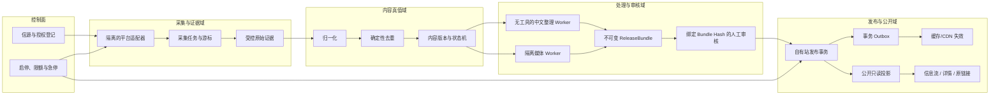

# F1+1 MVP 与系统架构决策包（proposed）

> 本文件是待统筹部提交用户逐项确认的提议，不是已接受的 ADR，也不构成开发、采购、平台授权、公开上线或自动发布授权。
>
> 本轮不冻结 Spec v1，不修改 `docs/spec.md`，不选择具体框架、数据库、队列、云厂商或基础模型，不初始化 `app/`。

## 0. 结论摘要

建议把首版收敛为“权利证据优先的白名单资讯闭环”：

1. **[建议]** 自动采集先覆盖第一方 RSS/Atom，以及逐站核准的新闻 Feed；社交平台只走官方、获批路径。X、Reddit 和 Instagram 未关闭各自授权、费用和内容使用门禁前，不承诺生产接入。
2. **[建议]** 访客侧先提供一个公开信息流、站内详情和原始链接；后台提供信源管理、人工审核、失败状态和下架/更正能力。参考站的日报、主题、收藏、分数、公共 API 等能力后置。
3. **[建议]** 系统采用“模块化核心 + 隔离适配器 Worker + 异步任务 + 事务状态库 + 公开投影”的逻辑架构。它能守住幂等、人工审核、故障隔离和可追溯性，同时避免首版微服务化。
4. **[建议]** 图片默认允许缺失。只有权利状态明确且通过媒体安全闸时才展示；自建通用图片代理不进入无条件 MVP。
5. **[建议]** 自动发布保持关闭。任何内容只能从绑定最终公开载荷的人工审核决定进入公开发布；未来自动发布需另立 accepted 决策并重新经过法务、安全、质量、稳定性和用户授权门禁。
6. **[事实｜E3]** 安全报告当前只允许离线、合成数据或获明确授权的小规模技术实验；对“真实平台持续采集、公开上线及自动发布准入”的结论仍为 fail。

## 1. 证据与表达规则

### 1.1 正式输入

- **E0 — 当前开发准绳：** [`docs/spec.md`](../../spec.md)。当前为 Spec v0 草案，阶段是 M1 需求澄清与 M2 风险调研。
- **E1 — 参考站证据：** [《AI Hot 公开产品与技术行为调研》](../../collaboration/部门/研究部/报告/2026-07-30-AI-Hot-公开产品与技术行为调研.md)。
- **E2 — 多平台采集证据：** [《多平台白名单信源稳定采集方案》](../../../research/multi-platform-source-collection-2026-07-30.md)。
- **E3 — 安全基线：** [《F1+1 采集、内容处理与发布安全基线审核报告》](../../collaboration/部门/安全部/报告/2026-07-30-F1+1采集内容处理与发布安全基线-审核报告.md)。
- **E4 — 参考审核：** [《协作地基与任务拆分审核报告》](../../collaboration/部门/测试部/报告/2026-07-30-协作地基与任务拆分-审核报告.md)。它只证明协作地基与任务拆分通过，不证明平台、架构或产品可上线。

### 1.2 标签

- **[事实]**：由 E0–E4 的直接证据或已确认项目合同支持。
- **[推断]**：基于事实做出的项目判断，仍需实验或进一步证据。
- **[建议]**：本决策包提出的范围、架构或实施选择。
- **[待确认]**：必须由用户、平台、法律顾问或后续独立审核给出结论。

没有标签的规范性语句都按 **[建议]** 处理，不视为已经接受。

## 2. 已确认事实与关键约束

1. **[事实｜E0]** 当前产品价值是持续监控用户指定的白名单信源，在信源正常可访问时争取于原内容发布后 15 分钟内发现，经中文整理和人工审核后进入公开阅读闭环。
2. **[事实｜E0]** 初期未经人工审核不得公开发布；禁止绕过登录、验证码、访问控制或平台反滥用机制。
3. **[事实｜E1]** AI Hot 的公开面可确认双层信息流、站内详情、来源证据、复合游标、版本化只读 API 和签名图片代理等行为；它的采集器、数据库、队列、权限、成本、容灾和安全内控无法从公开面确认。
4. **[事实｜E1]** AI Hot 的公开面包含日/周/月报、主题、收藏、分享海报、Markdown、Skill、RSS 和公共 API。**[推断｜E0、E1]** 同时实现这些能力会扩大当前 MVP；参考站存在这些功能不构成 F1+1 的范围授权。
5. **[事实｜E2]** X、Reddit、Instagram 的生产接入分别受费用、应用审批、账号类型、商业许可和内容使用条款制约。**[推断｜E2、E3]** 第一方 RSS/Atom 和许可明确的新闻 Feed 是当前更适合先验证 15 分钟目标的路径。
6. **[事实｜E2]** Instagram 个人账号及未授权自动采集没有稳定、合规的通用路径。**[建议｜E2]** 这类信源标为 `manual_only` 或 `blocked`，不承诺 15 分钟自动发现。
7. **[事实｜E2]** Formula 1 第一方 Feed 在报告取证时可访问，但 Feed 条目缺少 `pubDate`；文章页可见的 `datePublished` 仍需在允许访问条件下单独取得，才能计算发现延迟。
8. **[事实｜E3]** 当前没有真实平台审批、首批信源权利证据、图片策略、AI 供应商合同、部署架构或可运行实现；真实平台持续采集、公开上线和自动发布均未通过安全准入。
9. **[事实｜E3]** 外部文本、URL、图片和模型输出会引入 SSRF、XML 实体与资源耗尽、恶意媒体、XSS、提示注入、越权、重复发布、密钥泄露和版权/隐私风险。
10. **[事实｜E3]** 安全报告允许继续做离线威胁探针、获授权的小规模平台实验，以及不连接真实发布出口的队列、幂等、重试、死信和审计实验。

## 3. 产品决策提议

### P-01：MVP 的用户出口

**状态：proposed**

**[建议]** 首版访客侧只提供：

1. 一个公开信息流，默认按公开时间倒序，显示来源、作者、原始发布时间、中文标题/短摘要、可用时的合规图片或无图占位。
2. 一个站内详情页，显示可追溯的中文整理结果、来源证据、原始链接，以及内容的更正/下架状态。
3. 清晰的原始链接跳转。
4. 信源延迟、受限或内容下架时的真实状态。
5. 来源与内容类型两项基本筛选；全文搜索、标签和多条件组合筛选后置。

**[建议]** 首版后台只提供：

1. 白名单信源的新增、启停、采集能力和授权状态管理。
2. 待审核队列：核对来源、编辑、通过、拒绝。
3. 失败、限流、积压、死信、自有站事务待查询和未来外部出口 `reconcile_wait` 的可见状态与受控恢复。
4. 已公开内容的更正、下架和审计记录。

**[推断｜E0、E1]** 单一信息流已经能验证“发现 → 提炼 → 审核 → 阅读 → 原文”核心价值；同时建设“精选首页 + 全部动态”会提前引入精选规则、双入口定位和重复导航问题。

**[待确认]** 用户是否接受首版只有一个公开信息流，以及首版只含来源/内容类型基本筛选。无论采用单入口还是双入口，都必须先提供可视化预览，覆盖信息层级、关键交互、响应式布局和空/加载/失败/受限/下架状态；用户确认 UI 方向前不得进入正式实现。

### P-02：MVP 的信源范围

**状态：proposed**

| 级别 | 首版处理方式 | 进入条件 |
|---|---|---|
| 第一方 RSS/Atom | 自动采集主路径 | Feed 公开可用；逐源记录条款、权利、频率和删除规则 |
| 有明确许可的新闻 Feed / API | 自动采集主路径 | 授权与展示/缓存/摘要/删除边界有证据 |
| 无 Feed 新闻站 | 条件接入 | 逐站核准 Terms、robots、频率和内容使用；只做站点适配器 |
| X | 条件接入 | 用户确认测试费用和硬上限；官方用例获批；展示、摘要、留存与删除规则确认 |
| Reddit | 条件接入 | OAuth 实际获批；商业性质和许可结论明确；摘要/缓存/删除边界确认 |
| Instagram Professional Account | 条件接入 | 官方 API 路径可用；账号类型与授权成立；App Review/权限完成 |
| Instagram 个人账号或未授权账号 | `manual_only` | 仅允许人工提交已知原链接或经允许的官方嵌入 |
| 私有 API、Cookie、代理轮换、绕控抓取 | 排除 | 不设进入条件 |

**[建议]** MVP 验收时把信源分为 `api_monitorable / manual_only / blocked`。15 分钟目标只统计已接入、授权有效、可正常访问且时间戳可信的 `api_monitorable` 信源。

**[推断｜E2、E3]** 如果首批 MVP 强制同时自动覆盖 X、Instagram、Reddit 和新闻站，项目会在产品价值验证前被平台审批、商业许可和内容权利卡住。

**[待确认]** 用户需提供首批实际信源清单，并接受部分社交账号只能人工入口或延期接入。

### P-03：去重与事件聚合边界

**状态：proposed**

**[建议]** MVP 必须完成确定性去重：

- 来源内唯一键：`source_id + external_id`。
- 更新检测：规范化后的 `content_hash`。
- 辅助归并：规范化 canonical URL。
- 重试、重启和重复投递不得增加审核项或公开副本。

**[建议]** 跨平台“同一事件”只保留数据扩展位和人工关联能力；不把语义聚类、代表来源自动选择、公开重复数或“另有 N 家报道”作为 MVP 放行条件。

**[推断｜E1、E2、E3]** 确定性去重直接支撑幂等和发布安全；跨平台语义聚类需要阈值、错误纠正和来源优先级，过早加入会放大误合并风险。

### P-04：中文整理与人工审核

**状态：proposed**

**[建议]** 中文整理 Worker：

- 只接收最小必要的纯文本、来源字段和证据指针；
- 没有网络、密钥、管理工具或发布权限；
- 返回固定 schema：中文标题、短摘要、事实要点、来源引用、待核对项和模型/提示版本；
- 人名、车队、数字、时间和归因需要与来源证据对齐；
- schema 失败、证据不足、提示注入或高风险内容直接进入人工隔离。

**[建议]** 只有审核者针对当前 `content_version` 作出的有效通过决定，才可产生发布命令。内容实质更新后，旧审核资格失效。

**[建议]** 审核者完成必要编辑后，系统生成不可变的 `ReleaseBundle`。它至少绑定：

- `content_version` 与 `summary_draft_version`；
- 来源身份、canonical URL 和原始证据摘要；
- 公开媒体清单及其权利/安全版本；
- `authorization_version`、`source_config_version` 和 `policy_epoch`；
- 最终公开 schema、渲染字段和 `payload_hash`。

`ReviewDecision` 必须绑定 `release_bundle_id + payload_hash`；Publisher 只接受有效的 `review_decision_id + release_bundle_id + payload_hash`。标题、摘要、原始链接、媒体、权利状态或公开字段任一变化，都必须创建新 Bundle 并重新审核，旧批准自动失效。

**[待确认]** AI 供应商、数据区域、是否保留或训练输入、删除 SLA、子处理者和跨境边界。

### P-05：图片路线

**状态：proposed**

**[建议]** 首版按以下优先级处理：

1. 来源明确允许的官方嵌入或第一方媒体。
2. 有逐项授权、权利状态明确且通过安全处理的媒体副本。
3. 无图布局或占位。

**[建议]** 权利状态使用 `link_only / embed_allowed / excerpt_allowed / licensed / unknown`；`unknown` 不进入公开媒体投影。

**[建议]** 自建通用图片代理保持关闭。未来若启用，必须采用独立下载/解码隔离区、出站网络控制、逐跳重定向复核、私网与元数据地址阻断、字节/像素/帧数/耗时上限、拒绝 SVG/HTML/XML、固定安全格式重编码和独立媒体域名。

**[推断｜E0、E3]** “尽量展示图片”可以通过合规图片或无图降级满足；把有图率设为硬门槛会诱发放宽版权或 SSRF 控制。

**[待确认]** 用户需在“无图/仅原链接、官方嵌入、逐项授权镜像、自建安全代理”中确认可接受路线；法律与安全证据未齐前默认无图。

### P-06：公开评分、TOP 5 与精选

**状态：proposed**

**[建议]** MVP 不公开分数、推荐理由、TOP 5 或自动精选。低质量规则只用于阻止明显广告、垃圾、空内容和无关内容进入正常审核流，并允许人工纠偏。

**[推断｜E1]** 公开评分会增加评分定义、一致性、解释、操纵和申诉成本；当前核心成功标准不依赖公开分数。

**[待确认]** 若用户认为 TOP 5 是首版核心卖点，需要先定义评分用途、证据、阈值、人工纠偏和对外解释，再进入新 proposed 决策。

### P-07：自动发布

**状态：proposed**

**[建议]** 当前及 MVP 初期保持 `manual_only`。未来的自动发布只保留架构扩展点，不实现为默认开启能力。

**[建议]** 后续自动发布至少需要：

- 每个信源的许可、展示、留存和删除证据仍有效；
- 法务结论、全部安全反向探针、供应链探针、急停和凭证撤销演练通过；
- 独立安全复审通过，且没有开放的 P0/P1 问题和未关闭的权利人投诉；
- 至少 30 个连续日、500 条人工审核样本、每个拟自动信源至少 50 条；
- 严重事实错误、错误归因、错误原链接、敏感信息泄露和未授权媒体发布均为 0；
- 正常样本中至少 99% 于 15 分钟内进入处理流，重复公开数为 0，无无限重试、无丢失死信，备份恢复后无重复发布；
- 关键状态能在当班责任人的约定时限内告警，连续 30 天没有严重安全或发布事故；
- 先从 1 个权利清晰的低风险 RSS/自有信源、每天最多 5 条、连续 7 天 canary 开始；
- 全局急停、按信源子开关、失效闭合、版本 epoch、发布租约和外部出口 `reconcile_wait`（安全报告称 `publish_unknown`）对账有效。

**[事实｜E3]** 上述条件完整承接安全报告的准入表；任何摘要或后续转写都不得降低安全报告原门槛。相关数值是设计起点，不是已经验证或接受的门槛。

**[待确认]** 用户未来是否接受这组准入合同；即使接受，也不等于授权开启自动发布。

## 4. 系统架构候选

### A. 模块化核心 + 隔离 Worker + 异步任务（推荐）

**[建议] 逻辑形态**

- 一个控制/内容核心承载信源策略、内容状态机、审核、发布编排和后台 API。
- 每个平台使用独立的逻辑适配器、限速、熔断和指标；MVP 可共享 Worker 进程、持久任务表和队列基础设施。
- 中文整理与媒体处理使用无发布权的隔离 Worker。
- 一个支持事务和唯一约束的主状态库保存业务真值。
- 原始响应或媒体只进入受控、短期、按权利策略管理的隔离存储。
- 自有站公开投影优先与业务真值处于同一事务边界；事务 outbox 负责后续缓存/CDN 失效和其他异步副作用。

**[推断] 优点**

- 最少的部署与一致性复杂度；
- 能利用数据库事务、唯一约束和 CAS 守住审核与发布状态；
- 适配器和高风险处理仍可隔离、独立退避和熔断；
- 后续可按真实瓶颈拆分。

**[推断] 代价**

- 核心应用需要保持清晰模块边界；
- Worker 与核心之间必须有稳定合同；
- 未来高流量时可能需要拆分读模型或个别适配器。

### B. 每个平台和处理阶段独立微服务

**[推断] 优点**

- 故障和扩缩容边界最清楚；
- 平台团队可独立发布。

**[推断] 代价**

- 首版需要服务发现、跨服务追踪、消息版本、分布式一致性和更多运维；
- 当前信源数、流量和团队规模未知，无法证明这些成本有必要。

**判断：** **[建议]** 不选作 MVP 起点；当某适配器的规模、发布频率或合规隔离确有独立需求时再拆。

### C. 以第三方自动化/SaaS 工作流为主

**[推断] 优点**

- 低代码、原型快；
- 部分连接器开箱可用。

**[推断] 代价**

- 平台授权、数据保留、删除、密钥、提示注入、幂等和外部结果未知对账控制依赖供应商能力；
- 故障恢复和审计链可能难以满足本项目合同；
- 用量成本和供应商锁定难提前控制。

**判断：** **[建议]** 只可用于不含真实密钥和发布权的可丢弃实验，不作为生产主链。

### 推荐

**[建议]** 选择候选 A 作为 proposed 系统形态。

**[推断｜E0、E2、E3] 理由**

1. 当前第一目标是证明白名单内容能安全、及时、可追溯地经过人工审核进入阅读闭环。
2. 发布状态、审核版本和幂等要求强，集中事务真值比早期分布式事务更易验证。
3. 平台故障隔离通过适配器 Worker、独立队列、限速和熔断实现，无需先拆成多套完整服务。
4. 它保留后续按平台、媒体、公开读流量或合规域拆分的演进路径。

### 候选评估矩阵

**[推断｜E0、E2、E3]** 按同一组维度比较：

| 维度 | A 模块化核心 | B 微服务 | C SaaS 工作流 |
|---|---|---|---|
| 人工审核与发布一致性 | 强：集中事务和唯一约束 | 中：需处理跨服务一致性 | 弱到中：依赖供应商能力 |
| 平台故障隔离 | 强：逻辑隔离、独立限额/熔断 | 强：可物理隔离 | 不确定：受供应商故障域约束 |
| 恢复与对账难度 | 低到中 | 高 | 中到高且可见性有限 |
| 15 分钟延迟预算 | 可在统一任务真值中测量 | 可测量但链路更长 | 依赖第三方调度与配额 |
| 高风险处理隔离 | 可对媒体/XML/AI 单独进程与权限隔离 | 强 | 取决于供应商 |
| 首版运维成本 | 最低 | 最高 | 初期低、规模与治理成本不确定 |

**[推断]** 候选 A 的三项可证伪假设：

1. 集中事务能守住审核 Bundle、幂等和一个稳定公开 ID；
2. 高风险 I/O 能被独立限额、停用和进程/权限隔离；
3. 当前容量证据不足以证明微服务收益高于其一致性与运维成本。

**[建议]** E1–E5 任一实验推翻以上假设时，必须重新评估候选。物理拆分只在独立合规域、资源争用、发布频率、故障预算或容量实验达到明确阈值后提议。

**[待确认]** 本轮只确认逻辑边界和不变量，不冻结独立部署、独立 broker、独立数据库或独立 schema。具体语言、框架、数据库、队列、对象存储、部署平台和模型另行提议。

## 5. 推荐逻辑架构与数据流



### 分离的生命周期

```text
SourceHealth:
  active → delayed | rate_limited | auth_expired | blocked | manual_only

ContentVersion:
  discovered → normalized → filtered | ready_for_bundle | superseded

Task:
  pending → leased → succeeded | retry_wait | dead_letter | stale

ReviewDecision:
  pending → rejected | approved(bundle_id, payload_hash) | invalidated

Publication:
  absent → active(public_id, bundle_id) → corrected | withdrawn

ExternalPublication（未来、非 MVP）:
  pending → sent → confirmed | reconcile_wait | permanently_unknown
```

强制不变量：

1. `approved(release_bundle_id, payload_hash)` 之前不能产生公开投影；审核后 Bundle 不可变。
2. `content_version`、摘要、原始链接、媒体、权利、授权或政策版本任一变化，都生成新 Bundle 并使旧审核失效。
3. 每个内容只有一个稳定 `public_id` 和一个 active 公开投影；`publish_generation` 只表示修订/尝试，不能生成第二个公开条目。
4. 自有站 MVP 在同一事务内校验审核、急停、授权、撤回和 Bundle Hash，并写入公开投影与 outbox；outbox 只负责缓存/CDN 失效等异步副作用。
5. 未来外部发布出口只有在具备稳定目标 ID、原生幂等键或可验证查询协议时才可接入；必须定义一致性等待窗、对账时限和永久未知人工处置，`reconcile_wait` 不能直接重试。
6. 所有异步任务携带 `source_config_version`、`authorization_version`、`content/release_bundle_version`、`policy_epoch`、`recovery_epoch` 和 expected aggregate version；陈旧结果只记审计，不更新当前状态。
7. 每个“事务状态 → 异步任务”边界使用事务 outbox 或可证明等价的数据库派生任务；消费者使用 durable inbox、唯一任务 ID 和 CAS，防止孤儿任务与幽灵任务。
8. 消费者必须在同一数据库事务中完成 inbox 唯一写入、CAS 业务迁移和下游 outbox 写入；任一步失败整体回滚，不能把“已去重”与“业务已生效”拆成两次提交。
9. 信源许可过期、条款禁止、急停、审计失败或安全指标异常时，发布失效闭合。
10. 公开投影删除或更正不允许抹掉合法必要的脱敏审计事实；更正必须形成新 Bundle、重新审核并更新同一个稳定 `public_id`。

## 6. 模块与接口边界

| 边界 | 输入 | 输出 | 禁止 |
|---|---|---|---|
| Source Registry | 信源、适配器、授权证据、复查日期、频率、预算 | 可执行的版本化信源配置 | 保存真实 token；接受任意未核准 URL |
| Source Adapter | 版本化配置、受控凭证引用、旧游标、lease/fencing token | `SourceObservation[]`、候选新游标、限流和错误分类 | 自行推进游标；直接写公开库；直接调用 AI 或发布 |
| Ingestion | 适配器结果 | durable inbox、不可变来源修订、证据引用、发现时间 | 用抓取时间伪装来源发布时间；落库前推进游标 |
| Cursor Commit | 已持久化 inbox、旧游标、候选新游标、配置/授权版本 | CAS 后的新游标 | 旧 Worker 覆盖新游标；来源数据未持久化就推进 |
| Normalization / Dedupe | 来源修订 | 规范字段、内容版本、确定性去重结果 | 覆盖原始来源键；把语义相似当成确定重复 |
| Summary Worker | 最小纯文本、来源字段、schema、模型版本 | 结构化草稿、引用、待核对项 | 网络、密钥、后台工具、发布权限 |
| Media Worker | 核准媒体 URL、权利状态、用途 | 安全媒体引用或明确失败 | 在 Web 进程直接抓取/解析；未知权利时公开 |
| Bundle Builder | 当前内容/摘要/媒体/授权/政策版本 | 不可变 `ReleaseBundle + payload_hash` | 审核后原地修改 Bundle |
| Review | 当前 Bundle、来源证据、媒体状态 | 绑定 Bundle Hash 的通过/拒绝和审计记录 | 客户端单独决定权限；审核旧 Bundle 后发布新 Bundle |
| Self-site Publisher | 有效审核决定、Bundle Hash、幂等键、各类 epoch | 同事务公开投影与 outbox | 超时无条件创建新 public ID；绕过审核或版本围栏 |
| External Publisher（未来） | 经另行授权的 Bundle、稳定目标 ID、对账协议 | confirmed 或 reconcile 状态 | 目标不支持幂等/查询时接入；未知状态直接重试 |
| Public Read | 公开投影 | 信息流和详情 DTO | 暴露原始包、提示词、内部备注、凭证、详细错误 |

### 建议的适配器合同

```text
poll(source_config_version, authorization_version, cursor, lease_token, deadline)
  -> observations[]
  -> next_cursor
  -> rate_limit_state
  -> error_class
```

游标提交合同：

1. 一个响应页的 `observations[]`、任务 inbox 和必要证据引用先全部持久化；
2. 再在同一事务内用“旧游标 + `source_config_version` + `authorization_version` + fencing token”做 CAS 推进；
3. 原始对象采用 `staging → committed` 引用，失败后清理孤儿对象；
4. CAS 失败说明结果陈旧，只允许幂等合并已落库修订，不得覆盖当前游标。

`error_class` 至少区分：

- `transient_network`
- `rate_limited`
- `auth_expired`
- `permission_denied`
- `terms_blocked`
- `invalid_payload`
- `malicious_payload`

只有 `transient_network`、明确可重试的 408/5xx 和遵守 `Retry-After` 的 `rate_limited` 可进入有界重试。重试合同必须包含最大次数、最大累计时间、指数退避、全抖动、依赖级全局预算和人工升级条件。

限速与熔断至少按 `platform → credential/app → endpoint → source` 分层记录配额窗口、调用量和成本。每次外部调用前必须按共享 `credential/app + endpoint` 原子预占配额，调用后依据响应头和实际资源成本校正；无法读取共享限额状态时失效闭合。熔断器按真实故障域设置，单一凭证或信源的授权失败不得拖停其他已授权来源。

## 7. 数据边界

### 7.1 业务真值

1. `Source`：内部稳定 ID、平台、外部稳定 ID、展示名、canonical URL、适配器、monitorability、启停状态、轮询频率。
2. `AuthorizationRecord`：权限依据、证据指针、允许的采集/摘要/展示/缓存/删除用途、审核人、条款版本、复查和过期时间。
3. `SourceCursor`：来源游标、ETag、Last-Modified、配置/授权版本、lease/fencing、最后尝试/成功/错误、退避与熔断状态。
4. `SourceItem`：逻辑来源身份；优先以 `source_id + external_id` 唯一，external ID 缺失或疑似复用时进入人工规则，不靠 canonical URL 静默合并。
5. `SourceItemRevision` / `Observation`：不可变修订，包含 revision hash 或平台更新时间、canonical URL、必要文本、来源/发现时间、时间戳证据与置信度、权利和合规状态、受控原始引用。编辑、删除和保护状态都追加修订，不覆盖原证据。
6. `Content` / `ContentVersion`：规范化内容、哈希、版本关系、质量状态和当前状态机位置。
7. `SummaryDraft`：模型/提示/schema 版本、中文标题、摘要、事实要点、证据引用、待核对项。
8. `MediaCandidate`：来源、用途、权利状态、安全检查状态和隔离媒体引用。
9. `ReleaseBundle`：不可变的最终公开载荷合同，绑定内容、摘要、来源、媒体、授权、政策、公开 schema 和 `payload_hash`。
10. `ReviewDecision`：审核者、时间、`release_bundle_id + payload_hash`、通过/拒绝原因和审计证据。
11. `Publication`：稳定 `public_id`、`publish_generation`、幂等键、当前 Bundle、状态、外部可见时间、更正/下架关系。
12. `Task` / `Inbox` / `Outbox`：持久任务身份、业务幂等键、载荷指针/hash、版本 epoch、lease 和状态。
13. `TaskAttempt` / `DeadLetter`：原任务 ID、载荷指针/hash、配置/授权/policy/recovery epoch、错误分类、尝试预算、下次允许操作、trace ID。人工重放创建新 attempt，沿用业务幂等键并重新校验当前授权。

### 7.2 时间轴

至少分开记录：

- `source_published_at`
- `timestamp_confidence = source | page_metadata | inferred | unknown`
- `timestamp_source`
- `discovered_at`
- `fetched_at`
- `normalized_at`
- `summary_generated_at`
- `reviewed_at`
- `site_published_at`
- `edge_visible_at`

只有 `source_published_at` 有可信来源时才计算发现延迟；`inferred` 或 `unknown` 时间戳不能进入 15 分钟 SLO 验收。发布时间校正追加新修订和校正原因，不覆盖旧证据；SLO 分母规则按固定置信度口径版本化。

### 7.3 公开投影

公开 DTO 只含：

- 公开稳定 ID；
- 中文标题/摘要和必要事实要点；
- 来源平台、作者、原始发布时间、原始链接；
- 合规媒体引用或无图状态；
- 站内发布时间、更新/更正/下架状态。

公开 DTO 不含：

- 原始 API 包和受控原文；
- 平台 token、密钥引用和授权证据正文；
- 提示词、模型上下文、内部评分和审核备注；
- 内部错误堆栈、私有 URL、任务拓扑和个人操作细节。

## 8. 故障恢复合同

| 故障 | 安全状态 | 恢复路径 | 禁止动作 |
|---|---|---|---|
| 429、5xx、超时 | 平台/端点退避或熔断，保留最后成功游标，显示受限/延迟 | 遵守 `Retry-After`，半开探测，确认额度后定向重放 | 紧密重试、轮换账号规避限制、覆盖游标 |
| 授权过期、条款变化、平台拒绝 | 冻结对应适配器和再发布 | 复核数据保留/删除义务，取得新批准后重新启用 | 切换到爬虫、代理或其他账号继续 |
| Feed 损坏、时间戳缺失 | 任务进入可见错误；原游标不前移；时间戳为 unknown | 修复解析器或来源配置，从保留游标重放 | 用抓取时间伪造发布时间 |
| 提示注入或模型 schema/事实对齐失败 | 输出隔离，保持待人工核对，不产生可发布状态 | 保存最小对抗证据，更新回归样本，人工处理 | 反复调用模型直到“通过”；允许模型发指令 |
| 恶意图片、私网 URL、巨型图、伪装类型 | 媒体任务终止，主内容可无图待审 | 核查信源，安全复核后再解除媒体暂停 | 放宽校验换取有图；Web 进程直接解析 |
| 自有站发布事务超时 | 不创建新公开 ID；按稳定 `public_id` 和 Bundle Hash 查询事务结果 | 已提交则补发缓存失效 outbox；未提交才用同一幂等键重试 | 把连接超时等同于未提交；创建第二个公开项 |
| 未来外部发布结果未知 | 进入 `reconcile_wait`，在一致性等待窗内按稳定目标 ID 对账 | 明确未发布后受控重放；长期未知升级人工并冻结该出口 | 超时即重发；短暂 not-found 当成未发布；死信重放绕过对账 |
| 数据库/队列中断或备份恢复 | 停止新发布，提升 `recovery_epoch` 围栏旧 Worker，公开站维持最后一致读模型 | 恢复完整备份集合，先对账公开出口与撤销事实，再恢复消费者和定向重放 | 未对齐状态时全量重启；旧备份覆盖新撤销；从头抓取 |
| 密钥泄露 | 停止受影响适配器/发布器并封存证据 | 撤销、轮换、扫描仓库/日志/镜像/提示，评估通知义务，小流量恢复 | 先删日志；只改密码不撤销 token |

全局降级顺序：

```text
暂停低优先级信源
  → 只保存必要元数据
  → 停止 AI 整理
  → 停止媒体处理
  → 停止新发布
  → 保持最后一致公开内容可读
```

任何降级都不能跳过人工审核。

“只保存必要元数据”只有在已保存可恢复的来源身份、修订、URL、可信时间信息、权利状态和补采期限后才允许推进游标；无法保证后续补取的来源必须暂停轮询。补采任务需要优先级与过期状态，超过来源可恢复窗口后显式标为 `content_unrecoverable`，不得静默丢失。

备份恢复不变量：

1. 备份集合覆盖业务真值、inbox/outbox、任务与死信、幂等键、授权/撤销记录、删除 tombstone 和对象索引；
2. 公开投影可从业务真值重建，或有与备份一致的 checkpoint；
3. 恢复后先提升 `recovery_epoch`，所有旧 lease 与 Worker 输出失效，发布保持冻结；
4. 先对账已经公开的稳定 `public_id`，补录已可见事实，再恢复消费者；
5. 授权撤销、删除和下架使用单调版本；恢复后先把全部授权记录置为 `review_required`，合并独立、更新的撤销日志并重新核验当前权限证据前，相关采集和发布保持冻结；
6. 旧备份不能单独把 `review_required` 恢复为 active，也不能回退撤销、删除和下架事实；
7. RTO/RPO 数值待容量与业务容忍度确认，以上恢复不变量不等待数值选定。

## 9. 技术小实验顺序

所有实验都放在 `scratch/product-experiments/`，属于 disposable spike，不连接真实发布出口，不进入正式实现；结论被采纳后由开发部重新实现和测试。

### E1：无外部账号的 RSS 闭环

- 先把 15 分钟拆成可测预算：调度等待、抓取、持久化、归一化和进入处理队列；具体分配由实验测量后 proposed，不在此预填。
- 第一轮用 3 条固定样本做冒烟；随后随机化发布时间相位并注入调度抖动和队列积压，避免固定时刻掩盖最坏等待。
- 每 5 分钟轮询，验证解析、去重、重启重放、损坏 XML、429/`Retry-After`、游标 CAS 和陈旧 lease 围栏。
- 冒烟通过：3/3 均在 15 分钟内发现；重复投递、重启和重试后仍只有一个来源身份和正确的修订记录。统计性 SLO 需要更大真实样本，不能由 3 条样本证明。

### E2：Formula 1 第一方 Feed 被动观察

- 低频观察 24 小时，记录响应时间、状态、ETag/Last-Modified 和响应哈希。
- 新条目出现时，在允许访问条件下取得文章 `datePublished`。
- 24 小时无新条目则记为“无可验样本”，不能用本地实验代替真实来源时效证据。

### E3：状态机、幂等和恢复

- 用合成数据验证并发 100 次投递、内容更新、Bundle 被修改、发布超时、死信、备份恢复和急停竞态。
- 在 inbox/outbox 写前与写后、队列 ack 前与 ack 后、公开投影写前与写后、游标 CAS 前与后、备份恢复期间逐点 crash。
- 通过：没有漏项或孤儿任务；每个 Bundle 最多一个有效审核决定；每个内容只有一个稳定 `public_id` 和一个 active 投影；陈旧任务被围栏；恢复后不重复发布。

### E4：中文整理与人工审核离线试跑

- 使用公共领域、自建或明确授权的样本。
- 注入错误归因、数字/时间差异、提示注入、超长文本和 schema 外字段。
- 通过：模型没有工具行为；失败样本进入隔离；审核者能追到来源并修订/拒绝。

### E5：图片安全探针

- 默认不启用公开图片。
- 使用自建恶意样本验证私网地址、多跳重定向、DNS 变化、伪 MIME、SVG、像素炸弹、多帧动图和超时。
- 通过：无内网请求；资源预算生效；主内容可以无图继续审核。

### E6：获授权平台实验

按“X → Reddit → Instagram Professional Account”的独立门禁分别执行，不互相替代：

- X：用户先确认付费、硬 Spending Limit、测试账号和官方用例。
- Reddit：OAuth 实际获批；商业许可结论先于生产用途。
- Instagram：Meta App、Professional Account 和实际授权成立；个人账号直接 `manual_only`。

任一实验出现验证码、账号风控、平台拒绝、付费墙、robots 禁止或授权不足时，立即停止该路线。

## 10. 成本与预算边界

### 已知

1. **[事实｜E2，取证日快照]** X 报告记录的查询日公开价格为 Post Read 0.005 美元/资源、User Read 0.010 美元/资源，价格可能变化，购买前必须以官方控制台复核。
2. **[事实｜E2]** Reddit 商业价格需要单独协议；Meta 官方资料未给出本场景固定单价。
3. **[事实｜E0、E3]** 当前信源数量、更新频率、用户量、图片流量、AI 模型和部署方式未知，无法可靠给出月度总成本。

### 建议的成本模型

```text
平台成本
  = X 唯一资源读取
  + Reddit 合同
  + Meta 审批/运营
  + 其他付费 Feed/API

处理成本
  = 调度与队列
  + 文本提取
  + AI 输入/输出
  + 媒体下载、解码、存储与 CDN

运营成本
  = 人工审核
  + 条款/授权复查
  + 安全与告警值班
  + 更正、投诉与下架
```

### 预算控制提议

- 付费平台实验前由用户确认硬上限；
- 每个平台和信源单独计量；
- 达到 80% 预算时预警，达到 100% 时停止新读取；
- 费用、429、调用量和实际新增内容数同时观察；
- 未知价格不填入“免费”，保持 `unknown`；
- 不采购、不充值、不调用付费 API，直到用户明确授权。

## 11. 暂不做项

1. 日报、周报、月报、主题地图。
2. 收藏、已读同步、用户账号和个性化。
3. 分享海报、Markdown 导出。
4. 公共 API、RSS 输出和 Agent Skill。
5. 公开评分、推荐理由、TOP 5 和自动精选。
6. 开放关键词、全网搜索、平台热榜和自动发现新信源。
7. 跨平台语义事件聚类和代表来源自动选择。
8. 通用网页爬虫、私有 API、Cookie、代理轮换和任何绕控路径。
9. 自建通用图片代理和未知权利媒体公开展示。
10. 自动发布。
11. 具体技术栈、部署平台和基础模型选择。
12. 站内全文搜索、标签/多条件组合筛选和匿名反馈入口；MVP 只保留来源与内容类型两项基本筛选。

## 12. 需要用户逐项拍板

以下问题由统筹部提交用户。右侧只表示未获确认时应停在哪里，不构成默示接受、范围确认或执行授权。

| ID | 问题 | 产品部建议 | 未确认时安全停止状态 |
|---|---|---|---|
| U1 | 运营主体、是否商业化、目标用户地域、公开服务地域、部署地域是什么？ | 先明确再做真实平台与公开上线设计 | 只做离线实验 |
| U2 | 首批实际白名单有哪些？每个 Instagram 账号是否为 Professional Account？ | 先给 5–20 个代表信源并标注平台/账号类型 | 无真实信源接入 |
| U3 | 是否接受首版自动采集以 RSS/Atom 和许可明确的 Feed 为主，社交平台按授权逐个加入？ | 接受 | 社交平台 `manual_only/blocked` |
| U4 | 是否为 X 受控实验付费？硬 Spending Limit 是多少？ | 先做 RSS；确认低额上限后再测 X | 不产生 X 付费调用 |
| U5 | 项目商业化时是否愿意取得 Reddit 商业许可？ | 取得书面许可后接入 | 不进入生产 |
| U6 | Instagram 无法覆盖的个人账号是否接受人工链接入口和无 15 分钟承诺？ | 接受 | `manual_only` |
| U7 | 图片采用哪条路线：无图/仅原链接、官方嵌入、逐项授权镜像、自建安全代理？ | MVP 先“官方允许的嵌入或无图” | 无图 |
| U8 | 新闻和社交内容只展示中文短摘要、来源和原链接，还是需要全文/长期缓存？ | 只展示最小必要摘要与原链接 | 不存/不公开全文 |
| U9 | AI 供应商、数据区域、训练退出、保留/删除和跨境要求是什么？ | 先完成供应商数据条款评估 | 只用自建/公共领域样本离线试验 |
| U10 | 首版是一个公开信息流，还是“精选 + 全部动态”双入口？ | 一个公开信息流 | 信息架构保持 proposed，不进入正式 UI 设计/实现 |
| U11 | 是否公开分数、推荐理由或 TOP 5？ | MVP 不公开 | 不公开 |
| U12 | 是否接受候选 A 的逻辑架构和 E1→E6 的实验顺序？ | 接受 | 候选 A 保持 proposed，实验不执行 |
| U13 | 是否接受第 P-07 节作为未来自动发布准入合同的讨论起点？ | 接受为讨论起点 | 自动发布保持关闭 |
| U14 | 后台审核、发布、急停和应急值班分别由谁负责？ | 审核、发布、开关管理分权 | 不开放真实发布 |
| U15 | MVP 筛选范围是否接受“来源 + 内容类型”，把全文搜索、标签和组合筛选后置？ | 接受 | 筛选范围保持 proposed，不进入正式 UI 设计/实现 |
| U16 | 可视化预览采用什么交付形式，需重点判断哪些信息层级、交互和状态？ | 按项目规则必须先预览再实现 | 没有用户确认就不进入正式实现 |

另需法律顾问或平台书面确认：

1. 各平台的采集、中文摘要、缓存、公开展示、删除和商业用途。
2. 图片、头像、视频、比赛数据和 F1/FIA/车队/车手品牌标识的权利边界。
3. 外部 AI 处理的数据保护、训练、保留、子处理者和跨境要求。
4. 中国大陆公开运营时可能涉及的互联网新闻信息、算法推荐、生成式 AI 和内容标识义务。

## 13. 本 proposed 包的退出条件

进入 Spec v1 提议前，至少需要：

1. 用户完成 U1–U16 中影响 MVP 合同的决定。
2. 首批信源清单和逐信源 monitorability 初判完成。
3. 图片路线、AI 数据路线、后台角色和公开信息架构得到确认。
4. 公开信息流、详情、后台关键路径和响应式/空/加载/失败/受限/下架状态已有可视化预览，并得到用户对 UI 方向的明确确认。
5. E1–E5 中与所选范围相关的实验有可复核结果。
6. 平台费用、授权或商业许可仍未知的来源被明确排除、降级或设为门禁。
7. 产品部根据确认结果拆分或修订系统 ADR，并再次以 proposed 状态提交。
8. 安全、测试和开发分别完成独立的设计复核/可行性复核。
9. 用户明确接受后，才把相应 ADR 标为 accepted，并由统筹部决定是否进入 Spec v1 和 Kickoff。

## 14. 已验证、未验证与错题自检

### 仓库状态与内容覆盖已核查

- 已完整读取并明确引用 E1、E2、E3 三份正式输入。
- 已对照 E0，保持白名单、15 分钟条件、人工审核、阅读闭环和禁止绕控边界。
- 已把参考站公开可见事实与其不可见后端分开，没有反推数据库、队列、采集器、权限或 SLA。
- 已给出最小 MVP、暂不做项、三个架构候选、推荐理由、模块/接口/数据边界、九类故障恢复、实验顺序、成本边界和逐项用户门禁。

### 本轮执行边界自述

- 已保持 `status: proposed`；没有修改 Spec v0、没有冻结 Spec v1、没有初始化 `app/`。

### 未验证

- 首批真实信源、平台凭证、App 审批、商业许可和内容权利。
- 任何真实平台的 15 分钟发现率、限流、费用和删除同步。
- AI 供应商、摘要质量、提示注入稳健性和人工审核效率。
- 图片权利、代理、解码、重编码、缓存和下架实现。
- 具体技术栈、部署架构、容量、成本、RTO/RPO 和运维责任。
- 后台认证、授权、MFA、CSRF、审计、发布幂等和急停实现。
- 公开页面、交互和视觉；后续 UI 节点仍需可视化预览与用户确认。

### 错题自检

当前项目错题集没有已登记的历史错题条目；以下是本任务的额外专项自检：

- 没有把 AI Hot 的公开 DTO、前端栈、响应头或图片代理表现写成其后端实现事实。
- 没有把参考站扩展功能写入已获授权的 F1+1 MVP。
- 没有把社区 SDK 的许可证当作平台许可。
- 没有把 robots.txt 当作内容使用授权。
- 没有把“公开可见”写成可复制、摘要、缓存或再发布授权。
- 没有把 Instagram 个人账号、Reddit 商业用途或 X 费用写成已解决。
- 没有把测试部对协作地基的 pass 写成产品、平台、安全或上线放行。
- 没有把安全部提出的自动发布数值写成已验证或已接受门槛。
- 没有把“尽量有图”转换成放宽权利或安全控制的硬指标。
- 没有执行采购、付费 API、平台登录、真实发布、Spec 冻结或 `app/` 初始化。
